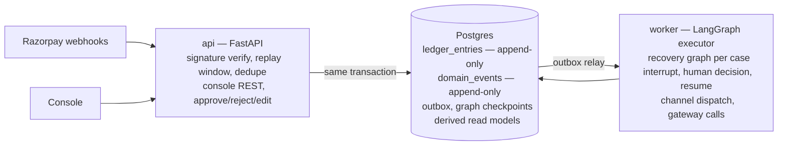
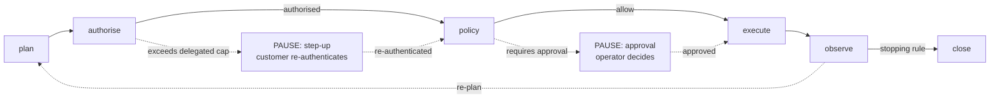

# Anvil

**A revenue-recovery control plane for failed recurring payments.**
Razorpay AI Buildathon 2026 · Track 03: AI Revenue Recovery

> Vulcan is Razorpay's forge. Anvil is where at-risk revenue gets hammered back into settled revenue.

---

## The problem

A subscription business with ₹1 crore of monthly recurring revenue on UPI Autopay and e-NACH mandates
will see **6–12% of debit attempts fail** in any given month. Around two thirds of those are
*recoverable*: insufficient funds that clear on payday, an expired card the customer would happily
replace, a bank-side technical decline that succeeds four hours later. The rest are terminal.

**The money is not lost at the decline. It is lost in the 48 hours afterwards**, during which most
merchants do one of two wrong things:

1. **Retry blindly on a fixed schedule** — day 1, day 3, day 5 — burning the mandate's finite retry
   allowance on decline codes that were never going to clear, and missing the ones that would have.
2. **Escalate identically to everyone** — the customer whose card expired gets the same dunning email
   as the customer who deliberately revoked their mandate. One is insulted; the other is ignored.

Both are *decision* failures, not infrastructure failures. That is what makes this an agent problem.

## The thesis

> **The model decides. The ledger disposes. Nothing the model says can move money.**

Anvil separates a *stochastic* decision layer from a *deterministic* execution layer. The LLM proposes;
a policy engine, a mandate registry and an append-only double-entry ledger dispose. Every rupee that
moves is traceable to a valid authorisation, a policy evaluation that permitted it, and either an
autonomous decision inside pre-agreed bounds or a named human's approval.

This inverts the usual agent architecture. Most frameworks put the model in the driver's seat and bolt
guardrails on afterwards. Anvil puts the **invariants** in the driver's seat and gives the model a
bounded steering wheel.

---

## Try it in one command

No credentials. No database. No network.

```bash
python3 -m venv .venv && .venv/bin/pip install -e ".[dev]"
.venv/bin/python scripts/tour.py
```

The tour runs the real code and prints live output across eight sections — exact money arithmetic, the
decline taxonomy escalating to the model, the scheduler's decisions with reasons, contact pressure
raising churn risk, a balanced four-legged concession posting, the policy engine refusing six different
things, and four complete agent runs including one where the model is entirely unavailable.

### The web console

```bash
make console          # http://localhost:8000
```

One process, one port, no build step and no database. The console is a single
self-contained page served by the API, which drives the seeded simulator in
process. That is a deliberate choice: a demo that needs a second process and a
Node toolchain is a demo that fails in front of a panel.

Seven screens, and four of them exist so the claims below can be *falsified*
rather than believed:

| Screen | What it is for |
|---|---|
| **Approval inbox** | Each item is a genuinely paused LangGraph thread sitting on a committed checkpoint. Approving resumes it, and it then runs authorisation, policy and the executor for real. Resolving with a stale version returns 409. |
| **Recovery cockpit** | The batch evidence: per-arm rates with bootstrap intervals, lift on the difference, the calibration table, and the limitations in full. |
| **At-risk cases** | The book, with each case's timeline and every action's legitimacy trail. |
| **Retry scheduler** | Change the failure date and watch the dynamic program move its answer — and show you the 24 hours it rejected. |
| **Policy engine** | All 27 rules, plus an evaluator you can throw arbitrary facts at, with the full rule-by-rule trace. |
| **Classifier** | Type a reason code. Watch `U30` resolve with no model call and `switch busy` escalate. |
| **Ledger** | Build a posting sequence and try to make it fail to balance. |

```bash
.venv/bin/python -m pytest tests/unit -q        # 203 tests
.venv/bin/python -m pytest -m invariant -q      # only the financial invariants
make batch                                      # the seeded experiment, in the terminal
open docs/board.html                            # visual build board
```

---

## Where AI is used — and deliberately is not

This track penalises LLMs bolted onto problems deterministic logic already solves, so this section comes
first rather than last.

### AI is used for four things, because rules genuinely fail at them

| Job | Why a rule engine loses |
|---|---|
| **Failure diagnosis** — map a heterogeneous signal bundle onto a structured hypothesis | `U30`, `Insufficient Funds`, `A/c bal low` and `NPCI:U30 debit failed` are the same fact, written by dozens of banks with no shared vocabulary. Enumerating that mapping is a losing game. |
| **Recovery planning** — choose a sequence from a *closed* action space under a live budget | The action space is closed; the trade-off surface is not. Whether ₹200 is worth spending to save a ₹1,499/mo mandate depends on churn risk, tenure and prior behaviour. |
| **Customer communication** — copy matched to cause, in the customer's language | "Your card expired" and "your account was short by ₹340 on Tuesday" need different tone. Templating this across languages produces the exact insulting mismatch described above. |
| **Policy compilation** — merchant prose into a versioned rule set | Natural language is the merchant's native format. The model *authors* policy; it never *is* policy. |

### AI is deliberately NOT used for these, and each was considered

| Job | What does it instead | Why |
|---|---|---|
| **Retry timing** | A dynamic program over calibrated hazard curves | A well-posed estimation problem with abundant labelled data. An LLM would be slower, worse and non-reproducible. Asking a model "when should I retry?" is the canonical version of the mistake this track penalises. |
| **Authorisation** | The mandate registry — a structural check against a stored object | An authorisation decision must be *provable*, not *plausible*. There is no acceptable false-positive rate. |
| **Budget arithmetic** | Ledger reservations under `SELECT … FOR UPDATE` | Models cannot be trusted with arithmetic that must balance to the paisa, and the ledger must stay correct when every model call fails. |
| **Stopping rules** | Deterministic policy predicates | A stopping rule the agent can talk itself out of is not a stopping rule. |
| **Money movement** | Idempotent gateway calls behind the ledger | The model never holds a credential and never calls a payment API. It emits a *proposal*. |

---

## The retry scheduler

The headline deterministic component. Retry timing is not "is now a good time" — it is *"given a finite
number of attempts against this mandate, when should I spend the next one?"* That is a sequential
decision problem, and treating it greedily is how dunning systems burn three attempts in 48 hours and
have nothing left for payday.

With `A` the amount at risk and `p(k,t)` the chance the *k*-th remaining attempt settles at hour `t`:

```
V(0, t) = 0
V(k, t) = max over t' >= t of [ p(k,t')·A + (1 − p(k,t'))·V(k−1, t' + gap) ]
```

The expression inside the max does not depend on `t`, so `V(k,·)` is a **suffix maximum** — one backward
pass per level, making the whole solve `O(attempts × horizon)` rather than quadratic.

Real output, from a ₹1,499.00 debit that failed on 18 September (mid-cycle, when balances are thinnest):

| Failure class | Next attempt | P(settle) | Expected value | Why |
|---|---:|---:|---:|---|
| `issuer_technical` | in 6h | 76.4% | ₹1,405.51 | The customer could always pay; the rail could not take the money. |
| `insufficient_funds` | in 11d 23h | 52.8% | ₹1,281.48 | Waits for the salary-credit peak. A greedy scheduler retries tomorrow and fails. |
| `limit_exceeded` | in 2d | 49.5% | ₹1,142.73 | Per-period caps reset on a boundary; waiting for it is the strategy. |
| `instrument_expired` | **refused** | — | — | The card is just as expired tomorrow. Every attempt here is waste. |
| `risk_declined` | **refused** | — | — | Retrying degrades the merchant's issuer risk score. Doing nothing beats doing something. |

The spread between the best and worst hour for a balance failure is roughly **seven-fold**. That gap is
the product: the same retry, placed correctly, is worth seven times as much.

---

## Architecture

Two processes, one Postgres, one schema.



A runaway model call cannot starve webhook ingestion, and workers scale independently — the benefit of a
control/data-plane split for the cost of one extra process rather than five extra services. Because the
event log and the read model commit in the *same* transaction, we get a provably complete audit trail
and free time-travel replay without eventual consistency in the UI.

### The recovery graph



**There is no edge into `execute` that skips `authorise` and then `policy`.** Authorisation is
structural and fails closed. Policy denies anything no rule permits, so a gap in the merchant's policy
*blocks* an action rather than allowing it.

Both pauses are real. LangGraph commits the checkpoint before the node yields, so the process can be
killed mid-pause and the case resumes exactly there — on a different machine, days later.

---

## The invariants

Enforced by tests that fail the build, and in two cases by Postgres itself.

1. **No balance is ever mutated.** Balances are summed from append-only entries. There is no stored balance.
2. **Every transaction balances to zero**, per currency, checked before anything is written.
3. **Money is integer minor units.** `Money.from_major(1499.00)` raises — floats are refused by the type.
4. **Every inbound webhook is processed at most once**, via a unique constraint on the Razorpay event id.
5. **Every outbound money-moving call carries a caller-generated idempotency key**, stable across retries.
6. **No action executes without a valid authorisation.** Fails closed.
7. **No action executes without a policy pass.** The decision, rule and bundle version are persisted with it.
8. **Concessions draw against a budget reserved under a row lock**, so concurrent cases cannot jointly overspend.
9. **Every state transition is replayable** from the checkpoint plus the event log.
10. **The audit log contains no raw PII.** Redaction happens before persistence, not on read.

Invariant 1 is enforced in the database, not just the application:

```
psql> UPDATE ledger_entries SET amount_minor = 999999999 WHERE id = 'len_...';
ERROR:  ledger is append-only: UPDATE on ledger_entries is refused. Post a reversal instead.
HINT:   Corrections are made by posting a mirrored REVERSAL transaction that
        references the original, never by editing it.
```

Verified against a superuser session. Inflating, deleting and rewriting a posted entry are all refused.

---

## Compliance

**DPDPA 2023.** Consent is a first-class table keyed by `(principal, purpose, notice_version)`. Every
channel send performs a real-time lookup for its *specific* purpose and fails closed. Suppressed messages
are **persisted with their reason** — "we did not contact this person, and here is why" is the record a
regulator asks for, and discarding it is how a compliant system becomes an unprovable one. Withdrawal
publishes an erasure event; ledger and audit rows are tombstoned rather than deleted, honouring erasure
without destroying the books.

**RBI.** No raw PAN is stored or logged. AFA step-up is modelled as a real graph interrupt rather than
assumed away. Quiet hours and contact-frequency caps are enforced deterministically.

**Agentic protocols.** Anvil models delegated agent authority and Single Block Multi Debit blocks as
first-class authorisation objects, in the shape NPCI's **proposed** Unified Agent Protocol describes.
UAP has **not launched** — it is expected at Global Fintech Fest 2026 and still requires RBI approval.
Anvil is designed *for* that shape; it does not claim to integrate with it.

---

## Failure modes

| Failure | Behaviour |
|---|---|
| Model down or rate-limited | Backoff, then the deterministic classifier and a conservative plan take over. Recovery continues with reduced sophistication — it never stops. The fallback never offers a concession, because pricing one was exactly the model's job. |
| Model returns malformed output | Pydantic rejects it, retry with the validation error appended, then human review. Never a partial write. |
| Model proposes an out-of-bounds action | Refused before execution and counted as a **model-safety event**, surfaced as a first-class metric rather than hidden. |
| Razorpay timeout on a debit | The outcome is genuinely unknown. The case parks in `PENDING_RECONCILIATION`, **nothing is written off**, and a reconciler polls with the same idempotency key. Never a blind retry. |
| Duplicate webhook | Unique-constraint violation, translated to `200 OK` with no business logic re-run. |
| Worker crashes mid-case | The checkpointer holds the last committed state; the case resumes from that node. |
| Two operators approve the same action | Row lock plus optimistic version check; the second sees a conflict and a refreshed view. |
| Concession budget exhausted mid-batch | Reservation fails deterministically; the planner is re-invoked with concessions removed from its space. |

---

## Layout

```
anvil/
  domain/      Money, the closed enums, 76 decline codes, retry hazard curves
  core/        config, injectable clock, prefixed ULIDs, errors, redacting logs
  db/          33 tables across seven modules, Alembic migrations
  ledger/      posting, derived balances, budget reservations, immutability triggers
  risk/        the DP scheduler, scoring, calibration, at-risk detection
  policy/      evaluator, 27-rule default bundle, content hashing, NL compiler
  graph/       13 LangGraph nodes, two durable interrupts, 12 dependency ports
  mandates/    the authorisation registry and AFA step-up
  llm/         Claude client, structured output, PII redaction, offline fixtures
  gateway/     Razorpay client, webhook verification, reconciliation
  channels/    outreach adapters, consent gate, frequency caps
  simulator/   seeded issuer, customer and world models
  evidence/    arm assignment, bootstrap statistics, batch reporting
  audit/       immutable trail, event log, outbox relay, time-travel replay
docs/
  ARCHITECTURE.md   the thesis, invariants, taxonomy, authorisation model
  DESIGN.md         the console design system
  board.html        visual build board — open in a browser
scripts/tour.py     the guided tour
```

The orchestrator imports none of the modules it drives. `anvil/graph/ports.py` declares twelve narrow
Protocols; the composition root supplies implementations. `LedgerPort` states in one place exactly how
much authority the agent has over the books: four economic events and nothing else.

---

## Honest limitations

This track asks for measured results and documented exceptions, so here is the state of things.

**Complete and tested** — `domain`, `core`, `db`, `ledger`, `risk`, `policy`, `graph`,
`simulator`, `evidence`, `api` and the console. 203 tests, clean lint.

**Partial** — `mandates` (the authorisation check is done; the persistent registry, consumption
accounting and the real step-up journey are not), `llm` (PII redaction done; the Claude client,
output schemas and offline fixtures are not — the batch runs on the deterministic fallback),
`gateway` (webhook verification and event parsing done; the REST client and reconciler are not),
`channels` (consent, frequency and adapters done; dispatch orchestration is not).

**Not started** — `audit` (the redaction gate, event log, outbox relay and time-travel replay).

**The headline result is not the one I wanted, and the report leads with it.** In the seeded batch,
naive fixed-schedule dunning beats the agent on raw recovery rate — around 86% against 65%, and the
difference is statistically significant. The calibration table says why: the retry curves in
`anvil/domain/taxonomy.py` are systematically over-confident by roughly 10 points, because they are
hand-written priors rather than parameters fitted to this issuer. `anvil/risk/calibration.py` is the
mechanism for fixing that, and until it has been run against real outcomes the scheduler is only as
good as its priors.

Two things this comparison does not price, both stated in the report: the baseline pays nothing here
for burning a mandate's finite presentment allowance or for damaging an issuer risk score, and the
batch runs with the **language model disabled**, so unclassifiable failures fall to `UNKNOWN` and get
one conservative attempt. Every number is a floor.

Tuning the simulator until the agent won would have been easy and would have made every other number
in this repository worthless.

**`docker-compose.yml` is committed but unverified.** Local development moved to a native Postgres 16
after Docker Desktop failed on this machine. Use the venv path above rather than compose.

---

## Development

```bash
brew install postgresql@16 && brew services start postgresql@16
createdb -h 127.0.0.1 anvil
.venv/bin/alembic upgrade head        # 33 tables + append-only triggers

.venv/bin/python -m pytest tests/unit -q
.venv/bin/ruff check anvil tests
.venv/bin/mypy anvil
```

Offline mode is the default and needs no Razorpay or Anthropic credentials.
