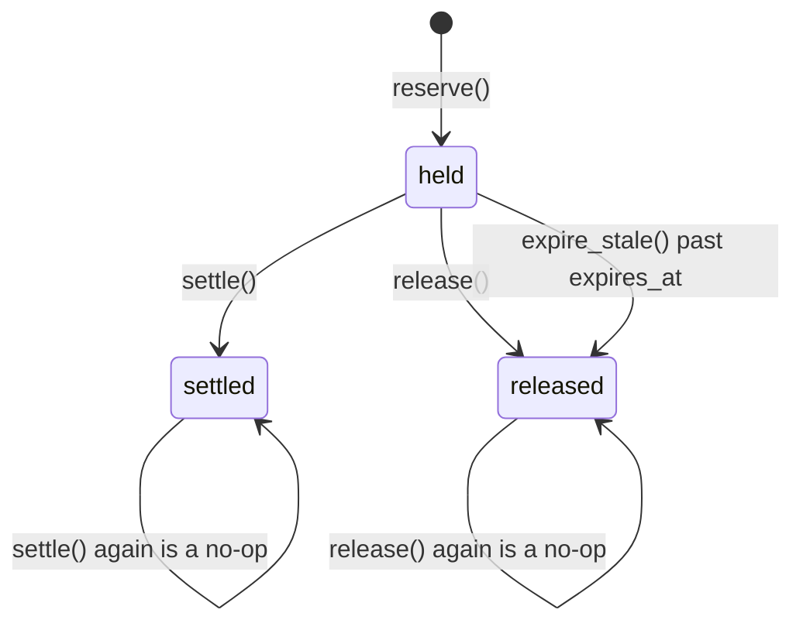

# Anvil — Money and the ledger

> The model decides. The ledger disposes. Nothing the model says can move money.

This is the reference for the two things that make that sentence true: the `Money` type, which
makes an amount impossible to get wrong by arithmetic, and the append-only double-entry ledger,
which makes a rupee impossible to move without a balanced, authorised, replayable record of where
it went.

Anvil keeps its own books rather than reading numbers back out of the payment gateway, because the
question a merchant actually asks after a recovery batch — *what did the agent bring back, what did
it give away, and what did it cost to do that?* — is a double-entry question, and nothing short of
a ledger answers it without hand-waving.

Everything below describes code that exists. Where something is specified but not yet wired, it
says so in [§9](#9-what-is-not-wired-yet).

**Source map**

| Concern | File |
|---|---|
| The money type | `anvil/domain/money.py` |
| Ledger vocabulary (`EntryDirection`, `AccountKind`, `LedgerTxnType`) | `anvil/domain/enums.py:99-127` |
| Chart of accounts | `anvil/ledger/accounts.py` |
| Posting construction, validation, commit | `anvil/ledger/posting.py` |
| Derived balances | `anvil/ledger/balances.py` |
| Concession budget and reservations | `anvil/ledger/reservations.py` |
| Append-only enforcement | `anvil/ledger/immutability.py`, `alembic/versions/9a1b2c3d4e5f_ledger_immutability.py` |
| Tables | `anvil/db/models/ledger.py` |
| The agent's authority over the books | `anvil/graph/ports.py:165` (`LedgerPort`) |
| The invariant tests | `tests/unit/test_ledger.py` |

---

## 1. Money

`Money` (`anvil/domain/money.py:48`) is a frozen, slotted dataclass of exactly two fields:

```python
Money(minor: int, currency: Currency = Currency.INR)
```

`minor` is an integer count of the currency's minor unit — paise for INR. There is no `Decimal`
amount field, no `float` anywhere on the path, and no scaling factor to get wrong. `__post_init__`
rejects a non-`int` `minor` (including `bool`) and a non-`Currency` currency with `TypeError`.

`minor` is signed. Negative values are legitimate and appear in intermediate arithmetic, but **the
ledger never uses sign to express direction** — an entry carries an explicit `EntryDirection` and a
strictly positive amount. A sign error is invisible on inspection; a wrong `EntryDirection` is not.

### 1.1 Currencies and minor units

`Currency` is a `StrEnum` with a fixed exponent per member. The exponent is a property of the
currency, never a caller-supplied parameter.

| Currency | Exponent | Symbol | Minor unit |
|---|---:|---|---|
| `INR` | 2 | `₹` | paisa |
| `USD` | 2 | `$` | cent |

### 1.2 Construction

| Builder | Accepts | Behaviour |
|---|---|---|
| `Money(149900)` | `int` | Direct, in minor units. No conversion. |
| `Money.zero(currency)` | — | `Money(0, currency)` |
| `Money.from_major(x, currency)` (`money.py:72`) | `str`, `int`, `Decimal` | Multiplies by `10**exponent` and quantises with `ROUND_HALF_EVEN`. **Refuses `float`.** |
| `Money.parse(text, currency)` (`money.py:84`) | `str` | Strips a leading currency symbol, commas and spaces, then defers to `from_major`. Empty input raises `ValueError`. |

```python
Money.from_major("1499.00")   # Money(149900, INR)
Money.parse("₹1,499")         # Money(149900, INR)
Money.from_major(1499.00)     # TypeError: refusing to build Money from float; pass str, int or Decimal
```

Sub-paisa input is quantised half-even, not truncated: `Money.from_major("1499.005")` is
`Money(149900)` and `Money.from_major("1499.015")` is `Money(149902)`.

### 1.3 Arithmetic rules

Permitted operations, all of them exact:

| Operation | Rule |
|---|---|
| `a + b`, `a - b` | Same currency only. Integer addition on `minor`. |
| `-a`, `abs(a)` | Sign flip, absolute value. |
| `a * n` | `n` must be `int` (`bool` refused). Repeated addition, never a ratio. |
| `a.scale(ratio, rounding=ROUND_HALF_EVEN)` (`money.py:144`) | Multiply by a `Decimal`/`str`/`int` ratio, then quantise. Banker's rounding by default so repeated scaling does not drift upward. |
| `a.percent(pct)` (`money.py:154`) | `scale(Decimal(pct) / 100)`. |
| `a.allocate(weights)` / `a.split(parts)` | Division that provably conserves the total — see [§1.4](#14-division-that-conserves). |
| `<`, `<=`, `>`, `>=`, `min`, `max`, `clamp` | Same currency only; a mismatch raises. |
| `is_zero`, `is_positive`, `is_negative` | Predicates on `minor`. |
| `sum_money(items, currency)` (`money.py:240`) | Sums a possibly-empty list; the currency argument covers the empty case. |

Forbidden operations, and what they actually raise:

| Expression | Result |
|---|---|
| `Money.from_major(1499.00)` | `TypeError: refusing to build Money from float; pass str, int or Decimal` |
| `Money(149900).scale(0.15)` | `TypeError: refusing to scale Money by float; pass Decimal, str or int` |
| `Money(100).percent(12.5)` (float) | `TypeError: refusing to take a float percentage of Money` |
| `Money(100) * 1.5` | `TypeError: Money can only be multiplied by int; use scale() for ratios` |
| `Money(100) * Money(2)` | Same `TypeError`. Money times money is not a money. |
| `Money(100) / 2`, `Money(100) // 2` | `TypeError: unsupported operand`. There is no division operator; use `allocate`/`split`. |
| `Money(100) + Money(100, USD)` | `CurrencyMismatchError: cannot combine INR with USD` |
| `Money(100) < Money(1, USD)` | `CurrencyMismatchError` — comparison checks currency too. |
| `Money(1.5)` | `TypeError: Money.minor must be int, got float` |
| `Money(True)` | `TypeError: Money.minor must be int, got bool` |

Equality is the dataclass default and does **not** raise: `Money(100, INR) == Money(100, USD)` is
`False`. Only the ordering and combining operations enforce the currency check.

Rounding worked through: 25% of ₹1,499.00 is `Money(37475)` — ₹374.75, exactly, no float in sight.
Half-even matters at the boundary: `Money(100).percent(Decimal("12.5"))` is `Money(12)`, not
`Money(13)`.

### 1.4 Division that conserves

`allocate(weights)` (`money.py:160`) is the only way to divide money. It uses the largest-remainder
method: integer shares first, then the remainder distributed one minor unit at a time, largest
fractional part first, ties broken by index. No rounding step can create or destroy value, so
`sum_money(m.allocate(w)) == m` holds for every input — including negatives, where the remainder is
distributed in steps of −1.

```python
Money(100_00).allocate([1, 1, 1])   # ₹33.34, ₹33.33, ₹33.33
Money(100).allocate([1, 2, 3])      # 17, 33, 50 paise
Money(-5).split(2)                  # -2, -3 paise
```

`split(parts)` is `allocate([1] * parts)`. Empty weights, negative weights and weights summing to
zero all raise `ValueError`; so does `split(0)`.

### 1.5 Display

`format()` groups Indian-style for INR (`₹12,34,567.89`) and Western-style otherwise, with the sign
ahead of the symbol (`-₹1,499.00`). `with_symbol=False` and `grouping=False` turn each off.
`major` returns the exact `Decimal` for further decimal maths — it is a conversion for display and
reporting, never an intermediate for ledger arithmetic.

### 1.6 How money is stored

`money_minor()` (`anvil/db/base.py:86`) is `BigInteger, nullable=False` — "a signed integer count
of minor units. Never a float, never a numeric." Currency is a three-character string coerced
through `CurrencyType` back into the `Currency` enum on read. Both ledger amount columns carry a
check constraint that the amount is strictly positive (`entry_amount_strictly_positive`,
`reservation_amount_positive`).

---

## 2. The chart of accounts

`AccountCode` (`anvil/ledger/accounts.py:45`) is a closed enum, for the same reason `ActionType` is
closed: a posting to an account nobody declared is a posting nobody can reconcile.

`CHART` (`accounts.py:82`) declares nine accounts. Eight exist once per merchant; one exists once
per customer.

| Code | Kind | Normal side | Scope | What it means |
|---|---|---|---|---|
| `merchant:receivable` | asset | debit | merchant | The control account: amounts being recovered that are **not** attributed to an identified customer. The per-customer accounts are its subsidiary ledger. |
| `customer:receivable` | asset | debit | customer | One customer's outstanding balance with this merchant. Used whenever the case has an identified customer, which is nearly always. |
| `merchant:cash` | asset | debit | merchant | Settled funds. Rises when a recovered debit clears; falls when money is earmarked for concessions or spent on a send or a model call. |
| `merchant:revenue` | revenue | credit | merchant | Revenue recognised on amounts that passed through Anvil, **gross** of concessions. Net revenue is this less contra-revenue. |
| `merchant:concession_budget` | asset | debit | merchant | Cash explicitly set aside for the agent to concede from. Held as a restricted asset so overspending is a ledger impossibility, not a rule someone can forget to check. |
| `merchant:concessions_granted` | contra_revenue | debit | merchant | What the agent gave away to save a subscription. Contra-revenue rather than expense, because a concession is a price reduction, not a purchase. |
| `merchant:channel_expense` | expense | debit | merchant | What outreach cost to send: SMS, WhatsApp, voice. Recorded per case so cost per recovered rupee can be reported honestly. |
| `merchant:model_expense` | expense | debit | merchant | Inference spend attributable to a case. An agent that recovers a rupee for a rupee of tokens has recovered nothing, and the only way to notice is to book it. |
| `merchant:write_offs` | expense | debit | merchant | Receivables Anvil has given up on. Its own line, so an abandoned case is visible rather than quietly leaving the recovery rate's denominator. |

### 2.1 Normal direction

`normal_direction(kind)` (`accounts.py:190`): assets, expenses **and contra-revenue** increase on
the debit side; liabilities and revenue increase on the credit side. Contra-revenue sits with the
debit group deliberately — it is a reduction of a credit-natured account, so it behaves like a debit
even though it lives in the revenue section of the P&L. (`AccountKind.LIABILITY` is declared in the
enum; no account in `CHART` currently uses it.)

### 2.2 Account ids are derived, not minted

`account_id_for(merchant_id, code, customer_id)` (`accounts.py:203`) is a blake2b digest of the
account's identity, base32-encoded behind an `acc_` prefix. Three consequences:

- `ensure_accounts` (`accounts.py:353`) is idempotent through a primary-key conflict
  (`ON CONFLICT DO NOTHING`) rather than a read-modify-write, so concurrent callers at the start of
  a busy batch cannot interleave into a duplicate.
- `ChartOfAccounts.derive(...)` computes the chart the database would hold **with no session at
  all**, which is what makes every posting builder unit-testable without a database.
- A seeded demo reproduces byte-identical account rows.

The price is that account ids do not sort chronologically. Nothing orders accounts by id, so the
price is never paid.

`load_chart` (`accounts.py:374`) reads the chart that actually exists and skips codes that are not
`AccountCode` members; a merchant with no accounts raises `NotFound` rather than silently returning
an empty chart. `ChartOfAccounts.ref` raises `NotFound` for a missing account instead of falling
back to a nearby one — falling back would post real money to the wrong place.

### 2.3 One receivable per rupee

`merchant:receivable` and `customer:receivable` are **alternatives, never both legs of one
posting**. Debiting both for the same rupee counts the asset twice. Every builder resolves through
`ChartOfAccounts.receivable_for(customer_id)` (`accounts.py:296`), which returns the customer
sub-account when the case has an identified customer and that sub-account exists, and the control
account otherwise. Exactly one, always.

### 2.4 The `accounts` table

`Account` (`anvil/db/models/ledger.py:39`) carries `id`, `merchant_id`, `code`, `name`, `kind`,
`currency`, nullable `customer_id` and `description`, under
`UNIQUE (merchant_id, code, customer_id)`. `description` is not decoration: it is the text an
operator reads in the console next to a balance they are being asked to trust.

---

## 3. Anatomy of a posting

A posting is built as a pure value, validated as a pure value, and only then written. Everything
above the "session-backed layer" comment in `posting.py` has no session, no I/O and no clock of its
own.

### 3.1 An entry

`EntryDraft` (`posting.py:47`) is one side of one posting: an `AccountRef`, an `EntryDirection`, and
a `Money`. Its `__post_init__` refuses two things outright:

- a non-positive amount — `"ledger entries must carry a strictly positive amount; direction, not
  sign, expresses which side the entry is on"`;
- an amount whose currency differs from the account's currency.

`debit(account, amount)` and `credit(account, amount)` are the constructors. `signed_minor` (debit
positive, credit negative) exists **only** for the balance check.

### 3.2 A transaction

`TransactionDraft` (`posting.py:90`):

| Field | Meaning |
|---|---|
| `merchant_id` | Tenant. Every entry's account must belong to it. |
| `txn_type` | A `LedgerTxnType` member — the economic event this records. |
| `currency` | Every entry must be in it. |
| `effective_at` | When it happened economically, which may differ from `created_at`. |
| `narration` | Human-readable, mandatory, non-blank. |
| `idempotency_key` | Required, not optional — see [§3.4](#34-idempotency). |
| `entries` | A tuple of `EntryDraft`. |
| `case_id`, `action_id`, `customer_id` | Optional provenance, indexed on the table. |
| `reverses_transaction_id` | Set only on a reversal. |

`LedgerTxnType` (`anvil/domain/enums.py:114`) has ten members:
`receivable_recognised`, `mandate_debit_settled`, `concession_granted`, `concession_reserved`,
`concession_released`, `budget_funded`, `channel_cost`, `model_cost`, `write_off`, `reversal`.
The two `concession_reserved` / `concession_released` members are never posted — see [§5](#5-reservations).

### 3.3 The balancing rule

`validate(draft)` (`posting.py:129`) is the gate. It raises rather than returning a result object,
because an unbalanced transaction is not a business outcome a caller might reasonably handle — it is
a defect, and the only correct response is to abort the enclosing transaction.

It refuses, in order:

1. no entries, or fewer than two — `"a single-entry transaction cannot balance"`;
2. a missing `idempotency_key`;
3. a blank `narration` — `"every posting must carry a narration a human can read"`;
4. any entry whose currency differs from the transaction's — Anvil does not post cross-currency
   transactions without an explicit conversion leg;
5. any entry whose account belongs to another merchant — `"a transaction may not span merchants"`;
6. **imbalance**: `sum(entry.signed_minor for entry in entries) != 0` raises
   `UnbalancedTransaction`, carrying `debits`, `credits` and the signed `imbalance` in its context.

```
debits ₹100.00, credits ₹99.00
UnbalancedTransaction: debits and credits differ by ₹1.00
context: {'debits': 10000, 'credits': 9900, 'imbalance': 100, ...}
```

The rule is per transaction and per currency, and it is checked before anything reaches
`session.add`. Every builder in [§4](#4-the-economic-events) calls `validate` on the way out, and
`post` calls it again as the first thing it does.

### 3.4 Idempotency

`PostingContext.key(*parts)` (`posting.py:235`) hashes
`(merchant_id, case_id or "-", action_id or "-", *extra_key_parts, *parts)` through
`anvil.core.ids.idempotency_key` (blake2b, 16 bytes, hex, `anvil_` prefix). The key depends only on
the *intent* — never on a timestamp, an attempt counter or a fresh id — which is what makes a
network retry collapse instead of paying twice. Each builder adds its own discriminator, so a
₹500.00 concession and a ₹500.00 settlement on the same case get different keys.

### 3.5 Committing

`post(session, draft)` (`posting.py:422`) is the only function that writes:

1. `validate(draft)`;
2. `SELECT` on the unique `idempotency_key`; if a transaction already exists, **return it**. A
   caller that posts twice is retrying, which is legitimate, and it should get the original
   transaction back rather than an exception to interpret. The unique constraint remains the real
   guarantee for the genuinely concurrent case;
3. insert one `ledger_transactions` row and one `ledger_entries` row per entry, `sequence` numbered
   from zero in draft order so replay is deterministically ordered;
4. `flush`.

`post_all` (`posting.py:473`) posts a sequence of drafts in the caller's unit of work: all or none.

### 3.6 The tables

`LedgerTransaction` (`db/models/ledger.py:74`) — `CreatedAtMixin` only, because append-only tables
never update. Unique `idempotency_key`; unique self-referencing `reverses_transaction_id` FK with
`ondelete="RESTRICT"`, so a transaction can be reversed at most once and a reversed transaction
cannot be deleted out from under its correction. Indexed on `(merchant_id, effective_at)` and
`(case_id, created_at)`.

`LedgerEntry` (`db/models/ledger.py:120`) — `transaction_id`, `account_id`, `direction`,
`amount_minor`, `currency`, `sequence`. Constraints: `amount_minor > 0`, `UNIQUE (transaction_id,
sequence)`, index on `(account_id, created_at)`.

Neither table holds a balance column. Neither table has an `updated_at`.

---

## 4. The economic events

Seven builders, one per economic event Anvil can cause. Each returns a validated
`TransactionDraft`.

| Builder | `txn_type` | Legs |
|---|---|---|
| `recognise_receivable` (`posting.py:247`) | `receivable_recognised` | 2 |
| `settle_recovered_debit` (`posting.py:273`) | `mandate_debit_settled` | 2 |
| `fund_budget` (`posting.py:293`) | `budget_funded` | 2 |
| `grant_concession` (`posting.py:316`) | `concession_granted` | 4 |
| `record_channel_cost` (`posting.py:352`) | `channel_cost` | 2 |
| `record_model_cost` (`posting.py:372`) | `model_cost` | 2 |
| `write_off` (`posting.py:397`) | `write_off` | 2 |
| `reverse_draft` (`posting.py:178`) | `reversal` | mirrors the original |

The worked examples below all use one case: a ₹1,499.00 subscription debit that failed, for an
identified customer, against a merchant whose concession budget has been funded with ₹50,000.00.
Every table is real output from the builders.

### 4.1 The merchant earmarks a budget

`fund_budget(ctx, Money(50_000_00))` — restricted cash, not a number in a config file.

| # | Account | Direction | Amount |
|---:|---|---|---:|
| 0 | `merchant:concession_budget` | debit | ₹50,000.00 |
| 1 | `merchant:cash` | credit | ₹50,000.00 |

*Narration:* `Concession budget funded with ₹50,000.00`

### 4.2 The case opens: recognise the receivable

`recognise_receivable(ctx, Money(1_499_00))`, posted by the intake node
(`anvil/graph/nodes/intake.py:31`) the moment a case opens.

| # | Account | Direction | Amount |
|---:|---|---|---:|
| 0 | `customer:receivable/cus_demo` | debit | ₹1,499.00 |
| 1 | `merchant:revenue` | credit | ₹1,499.00 |

*Narration:* `Receivable recognised, ₹1,499.00 at risk`

Recognising here rather than at recovery time is what lets a later write-off reduce a real asset
instead of being a memo nobody can reconcile, and it makes "how much are we chasing right now?" a
balance rather than a query over case rows.

### 4.3 A failed debit posts nothing

There is no builder for a failed attempt, and the executor posts nothing when one fails
(`anvil/graph/nodes/act.py`). A decline is not an economic event: the receivable was already
recognised at case open and it has not changed. The attempt is recorded in the audit trail with its
decline code, and the case re-plans.

The same holds, more sharply, for `outcome == "unknown"` — a gateway timeout. The books stay
untouched, the case parks in `PENDING_RECONCILIATION`, and the reconciler resolves it with the same
idempotency key. Recording a recovery that cannot be confirmed would be worse than recording
nothing.

### 4.4 A concession: reserve, then grant

The executor takes a hold first and grants only if the hold succeeded
(`act.py:230` → `act.py:251` → `act.py:259`). If the hold is refused, the action is abandoned and
the planner is re-entered with concessions effectively unavailable — the correct behaviour, not an
error.

`grant_concession(ctx, Money(200_00))` has **four** legs, because two distinct things happen and
collapsing them would hide one:

| # | Account | Direction | Amount | Why |
|---:|---|---|---:|---|
| 0 | `merchant:concessions_granted` | debit | ₹200.00 | The cost lands in contra-revenue: a concession costs revenue, not cash. |
| 1 | `customer:receivable/cus_demo` | credit | ₹200.00 | The customer owes ₹200.00 less. |
| 2 | `merchant:cash` | debit | ₹200.00 | The restricted cash returns to general cash. |
| 3 | `merchant:concession_budget` | credit | ₹200.00 | The earmark that authorised it is consumed. |

*Narration:* `Concession of ₹200.00 granted against the authorised budget`

Netting legs 2 and 3 away would make "how much of the authorised budget has been used?"
unanswerable from the ledger alone. The merchant never pays anybody — nobody is richer or poorer in
cash terms — they simply agree to receive less.

### 4.5 The retry settles

`settle_recovered_debit(ctx, Money(1_299_00))`, posted from `act.py:158` when the gateway returns
`settled`. This is the money the agent recovered.

| # | Account | Direction | Amount |
|---:|---|---|---:|
| 0 | `merchant:cash` | debit | ₹1,299.00 |
| 1 | `customer:receivable/cus_demo` | credit | ₹1,299.00 |

*Narration:* `Recovered ₹1,299.00 on a previously failed mandate debit`

### 4.6 What the recovery cost

`record_channel_cost(ctx, Money(25), "whatsapp")` and
`record_model_cost(ctx, Money(3), "claude-opus-5")`:

| Account | Direction | Amount |
|---|---|---:|
| `merchant:channel_expense` | debit | ₹0.25 |
| `merchant:cash` | credit | ₹0.25 |

| Account | Direction | Amount |
|---|---|---:|
| `merchant:model_expense` | debit | ₹0.03 |
| `merchant:cash` | credit | ₹0.03 |

Posting model spend to the same books as the recovered revenue is what makes the economics of the
agent arguable rather than assumed.

### 4.7 Abandonment

`write_off(ctx, Money(1_299_00), "mandate revoked")`, posted by the close node
(`anvil/graph/nodes/close.py:106`) for whatever is still outstanding.

| # | Account | Direction | Amount |
|---:|---|---|---:|
| 0 | `merchant:write_offs` | debit | ₹1,299.00 |
| 1 | `customer:receivable/cus_demo` | credit | ₹1,299.00 |

*Narration:* `Wrote off ₹1,299.00: mandate revoked`

The close node refuses to write off a case that is `RECOVERED` or `PENDING_RECONCILIATION`. An
unresolved attempt may already have taken the money; writing it off would understate what the
merchant is owed and would have to be reversed the moment it resolves.

### 4.8 Corrections are reversals, never edits

`reverse_draft(original, original_id, ...)` (`posting.py:178`) mirrors every leg, sets
`txn_type=REVERSAL`, points `reverses_transaction_id` at the original and prefixes the narration
with `Reversal of <id>:`. The original object is not touched — a test asserts the entries tuple is
literally the same object afterwards.

Reversing the concession above:

| # | Account | Direction | Amount |
|---:|---|---|---:|
| 0 | `merchant:concessions_granted` | credit | ₹200.00 |
| 1 | `customer:receivable/cus_demo` | debit | ₹200.00 |
| 2 | `merchant:cash` | credit | ₹200.00 |
| 3 | `merchant:concession_budget` | debit | ₹200.00 |

*Narration:* `Reversal of ltx_01J8ZQ: operator error`

Every account the original touched returns to its prior position, and the history shows both that a
mistake was made and that it was fixed — which is the information an auditor actually wants.
`reverse(session, ...)` (`posting.py:480`) derives the reversal's own idempotency key from
`("reversal", original_id)`, so a retried reversal collapses and the unique
`reverses_transaction_id` constraint makes a double reversal impossible.

### 4.9 The whole case, as a trial balance

After §4.1–§4.6 (budget funded, receivable recognised, one WhatsApp send, one model call, a ₹200.00
concession, ₹1,299.00 recovered):

| Account | Kind | Debits | Credits | Natural |
|---|---|---:|---:|---:|
| `customer:receivable/cus_demo` | asset | ₹1,499.00 | ₹1,499.00 | ₹0.00 |
| `merchant:cash` | asset | ₹1,499.00 | ₹50,000.28 | −₹48,501.28 |
| `merchant:channel_expense` | expense | ₹0.25 | ₹0.00 | ₹0.25 |
| `merchant:concession_budget` | asset | ₹50,000.00 | ₹200.00 | ₹49,800.00 |
| `merchant:concessions_granted` | contra_revenue | ₹200.00 | ₹0.00 | ₹200.00 |
| `merchant:model_expense` | expense | ₹0.03 | ₹0.00 | ₹0.03 |
| `merchant:receivable` | asset | ₹0.00 | ₹0.00 | ₹0.00 |
| `merchant:revenue` | revenue | ₹0.00 | ₹1,499.00 | ₹1,499.00 |
| `merchant:write_offs` | expense | ₹0.00 | ₹0.00 | ₹0.00 |
| **Total** | | **₹53,198.28** | **₹53,198.28** | **imbalance ₹0.00** |

`net_revenue` = ₹1,499.00 − ₹200.00 = **₹1,299.00**.
`total_recovery_cost` = ₹200.00 + ₹0.25 + ₹0.03 = **₹200.28**.
The customer's receivable is back to zero: ₹1,499.00 recognised, ₹200.00 conceded, ₹1,299.00 paid.

Cash reads negative because these books contain only Anvil's own activity — there is no builder for
the merchant's opening cash contribution, so the ₹50,000.00 earmark has nothing to draw against.
That is a property of the chart as it stands, not an error in the postings; the trial balance still
balances to the paisa, and `Balance.is_negative_in_natural_terms` (`balances.py:61`) is what
surfaces an account holding the opposite of what it should.

---

## 5. Reservations

`LedgerTxnType` carries `CONCESSION_RESERVED` and `CONCESSION_RELEASED`, and **`posting.py` never
posts them**. A hold is not an economic event: no value has moved and the merchant is neither
richer nor poorer for it. Posting holds would fill the ledger with pairs that always net to zero and
make the trial balance a worse description of reality. Holds live in `anvil/ledger/reservations.py`
as first-class rows; only the concession that eventually lands reaches the books.

### 5.1 The budget

`ConcessionBudget` (`db/models/ledger.py:217`) is one row per merchant per period:
`funded_minor`, `currency`, `per_customer_cap_minor`, `per_action_cap_minor`,
`max_percent_of_mrr` (default 25), `period_start`, `period_end`. Check constraints keep funding
non-negative, both caps strictly positive, the MRR percentage in `[0, 100]` and the period ordered.
It deliberately stores no computed balance.

`BudgetPosition` (`reservations.py:45`) is the derived view:

```
headroom = funded - settled - held
utilisation_bps = (settled + held) * 10_000 / funded
```

Settled money is gone; held money is merely spoken for and may come back. Headroom subtracts both,
because a hold that might be released is not headroom you can promise to someone else in the
meantime. `utilisation_bps` computes in `Decimal` and truncates to an `int`, so ₹200.00 held against
a ₹300.00 budget reports 6,666 rather than 6,667. It reports 10,000 (100%) for an unfunded budget
with anything outstanding, and 0 for an unfunded budget with nothing outstanding.

### 5.2 A hold

`BudgetReservation` (`db/models/ledger.py:166`) carries `budget_id`, `case_id`, `action_id`,
`customer_id`, `amount_minor`, `currency`, `state`, `expires_at`, `settled_at`, `released_at` and a
unique `idempotency_key`. `state` is constrained to `held | settled | released`.



`settle` on a released hold raises `ValidationError` — take a fresh hold instead. `release` on a
settled concession raises `ValidationError` — post a reversal instead. Both edges are refusals, not
recoveries.

### 5.3 The caps

`check_caps` (`reservations.py:110`) is pure, and checks in a deliberate order so the refusal is the
most useful one available: the caps that describe a policy the merchant set are checked before plain
headroom.

| Order | `limiting_cap` | Refuses when |
|---:|---|---|
| 1 | `amount` | The requested amount is not positive. |
| 2 | `per_action_cap` | It exceeds the budget's per-action ceiling. |
| 3 | `per_customer_cap` | Already-conceded plus requested exceeds the per-customer ceiling. |
| 4 | `max_percent_of_mrr` | It exceeds that percentage of the subscription's monthly value (skipped when MRR is zero). |
| 5 | `headroom` | It exceeds `funded − settled − held`. |

`CapCheck` returns *why* rather than a bare boolean, because those five outcomes imply five
different corrective actions for the operator reading the console.

The MRR ceiling is exact at the boundary: 25% of ₹1,499.00 is ₹374.75, and ₹374.75 is allowed while
₹374.76 is not.

### 5.4 Taking, settling and reclaiming holds

`reserve` (`reservations.py:209`):

1. return an existing reservation if the `idempotency_key` matches — a replayed action reuses its
   hold rather than taking a second one;
2. `SELECT … FOR UPDATE` on the **budget row** (`_load_budget_locked`, `reservations.py:167`);
3. refuse a currency that does not match the budget;
4. compute the position and the customer's already-conceded total (`held` + `settled`), run
   `check_caps`, and raise `BudgetExhausted` with the limiting cap, the requested amount and the
   remaining headroom if it fails;
5. insert the hold with `expires_at = now + hold_minutes` (`DEFAULT_HOLD_MINUTES = 120`).

The lock is on the budget row and not on the reservations, because headroom is a property of the
*set* of reservations: no lock on any individual reservation can protect it, since two transactions
could each insert a row that is fine on its own and jointly overspend. Locking the single budget row
serialises the read-compute-insert sequence, which is the smallest thing that makes the arithmetic
safe, and scopes contention to one merchant's budget rather than the whole table. The lock is held
until the caller's transaction commits, so the headroom computed inside it cannot be invalidated
before the row lands.

`settle` and `release` (`reservations.py:276`, `:296`) both take `with_for_update` on the
reservation and are idempotent in their own direction. `expire_stale` (`reservations.py:317`)
releases holds past their deadline, `FOR UPDATE SKIP LOCKED`, up to a limit, and returns how many it
freed — without it, a crashed worker would permanently shrink a merchant's budget by whatever it was
holding, and the shrinkage would be invisible.

---

## 6. Immutability

Application-level enforcement protects only the paths that go through the application. A migration
that "just fixes one row", a psql session at 2am, or a future module that adds its own writer would
all bypass it. So the ledger tables refuse mutation **inside Postgres**.

`LEDGER_IMMUTABILITY_DDL` (`anvil/ledger/immutability.py:27`) installs
`anvil_reject_ledger_mutation()` as a `BEFORE UPDATE OR DELETE … FOR EACH ROW` trigger on four
tables (`PROTECTED_TABLES`, `immutability.py:75`):

- `ledger_entries`
- `ledger_transactions`
- `domain_events`
- `audit_records`

```
psql> UPDATE ledger_entries SET amount_minor = 999999999 WHERE id = 'len_...';
ERROR:  ledger is append-only: UPDATE on ledger_entries is refused. Post a reversal instead.
HINT:   Corrections are made by posting a mirrored REVERSAL transaction that
        references the original, never by editing it.
```

The exception is raised with `ERRCODE = 'restrict_violation'`. The DDL is idempotent
(`CREATE OR REPLACE`, `DROP TRIGGER IF EXISTS`) and is applied by migration
`alembic/versions/9a1b2c3d4e5f_ledger_immutability.py`, which imports the same constant the
application exports — there is no second copy of the SQL to drift.

**The one escape hatch** is `anvil.allow_ledger_mutation`, a session GUC the trigger checks for the
value `'on'`. Nothing in Anvil ever sets it. It exists because a genuine disaster-recovery operation
must be *possible*: an immutability rule with no documented override gets dropped in a panic, which
is strictly worse than one that must be turned on explicitly, leaves the intent in the session
settings, and can be alerted on.

Immutability is reinforced above the database too:

- `LedgerTransaction` and `LedgerEntry` use `CreatedAtMixin`, not `TimestampMixin` — append-only
  tables have no `updated_at` to write.
- The ledger package's `__init__` docstring states that nothing outside the package should construct
  a `LedgerEntry` directly, because that bypasses the balance check.
- `LedgerPort` (`anvil/graph/ports.py:165`) is the agent's entire authority over the books:
  `recognise_receivable`, `settle_recovered`, `grant_concession`, `write_off`, plus
  `reserve_concession` / `settle_concession` / `release_concession`. There is no `post` and no way
  to construct an arbitrary entry, so a bug in a node cannot invent a posting the chart never
  anticipated.
- Every foreign key on the ledger tables is `ondelete="RESTRICT"`, so nothing a ledger row depends
  on — its merchant, its account, its customer, its transaction — can be deleted underneath it.

---

## 7. Balances

There is no stored balance anywhere in Anvil, and therefore nothing that can drift away from the
history that produced it. Every figure in `anvil/ledger/balances.py` is a `SUM` over
`ledger_entries`.

`Balance` (`balances.py:37`) holds an account plus its total debits and total credits:

- `signed` = debits − credits;
- `natural` flips the sign for credit-natured accounts, so a healthy revenue account reads positive
  — which is what an operator expects and what the console renders;
- `is_negative_in_natural_terms` flags an account holding the opposite of what it should. Not
  automatically an error — a receivable can go negative for an instant if a settlement is posted
  before its recognition — but always worth surfacing.

`balance(session, account, as_of=None)` (`balances.py:167`) groups one account's entries by
direction. `balances_for(session, merchant_id, currency, as_of=None)` (`balances.py:204`) does the
whole chart in **one** query, outer-joining a grouped subquery onto `accounts` so that accounts with
no entries come back at zero: omitting them would make an empty account indistinguishable from a
missing one, and "the concession budget account does not exist" is a very different problem from
"the concession budget is empty".

Point-in-time uses `LedgerTransaction.effective_at`, never the entry's `created_at`. A settlement
that lands late belongs to the day it settled economically, not the day the webhook arrived.

`TrialBalance` (`balances.py:85`) wraps the set with the proof that it balances:

| Member | Meaning |
|---|---|
| `total_debits`, `total_credits`, `imbalance`, `balances_out` | The arithmetic. |
| `assert_balanced()` | Raises `InvariantViolation` if the books do not balance. |
| `by_code(code)` | Natural total across every account with that code, summing per-customer sub-accounts. |
| `by_kind(kind)` | Natural total for an `AccountKind`. |
| `net_revenue` | `merchant:revenue` − `merchant:concessions_granted`. |
| `total_recovery_cost` | concessions + channel + model. |

If `assert_balanced` ever fires in a running system, something has written entries outside `post`,
and the correct response is to stop, not to reconcile.

**The cost, stated plainly.** A balance is a scan rather than a lookup. That is worth paying at this
scale for one reason: the failure mode of a stored balance is silent — a cached balance that is
wrong looks exactly like one that is right, and you find out during an audit. If this needed to
scale past what a merchant-scoped index scan will carry, the correct next step is a materialised
rollup with the derivation kept as the authority to check it against, not a mutable balance column.

---

## 8. The invariants, and the test that proves each

Four of the ten invariants in `docs/ARCHITECTURE.md` §6 are the ledger's. `tests/unit/test_ledger.py`
holds 25 tests, 8 of them marked `@pytest.mark.invariant`. They are properties rather than examples,
because "this particular posting balances" is a much weaker claim than "no posting this module can
construct fails to balance".

```bash
.venv/bin/python -m pytest tests/unit/test_ledger.py -q   # 25 tests
.venv/bin/python -m pytest -m invariant -q                # the 8 marked invariants
```

| # | Invariant | Enforced by | Proven by |
|---:|---|---|---|
| 2 | Every transaction balances, per currency, checked before anything is written | `posting.py:129` `validate`, called by every builder and by `post` | `tests/unit/test_ledger.py:84` `test_every_builder_produces_a_balanced_transaction` — Hypothesis, 200 examples, every builder × every amount. *The single most important test in the repository.* |
| 2 | A hand-built imbalance is refused before anything is written | `posting.py:165-174` | `tests/unit/test_ledger.py:98` `test_unbalanced_transaction_is_refused` (asserts the reported imbalance is 100 paise) |
| 2 | `validate` accepts *exactly* the balanced arrangements — no false accepts, no false rejects | `posting.py:129` | `tests/unit/test_ledger.py:122` `test_validate_accepts_exactly_the_balanced_arrangements` — 300 generated debit/credit multisets |
| 3 | Entries are strictly positive; direction, not sign, carries the side | `posting.py:59` `EntryDraft.__post_init__`; `entry_amount_strictly_positive` check constraint | `tests/unit/test_ledger.py:154` `test_entries_must_be_strictly_positive` |
| 3 | Floats cannot reach a posting | `money.py:77`, `money.py:149` | `tests/unit/test_ledger.py:161` `test_money_cannot_be_built_from_float` |
| 3 | Division conserves every paisa | `money.py:160` `allocate` | `tests/unit/test_ledger.py:170` `test_allocation_conserves_every_paisa` — up to ₹10^10, split 1–40 ways |
| 3 | A transaction may not span merchants | `posting.py:157` | `tests/unit/test_ledger.py:286` `test_a_transaction_may_not_span_merchants` |
| 3 | A single-entry transaction is refused | `posting.py:139` | `tests/unit/test_ledger.py:304` `test_single_entry_transactions_are_refused` |
| 1 | A correction nets the original to zero and never edits it | `posting.py:178` `reverse_draft` | `tests/unit/test_ledger.py:186` `test_reversal_nets_the_original_to_zero`; `:203` `test_reversal_never_edits_the_original` |
| 5 | The idempotency key depends only on intent, so a retry collapses | `posting.py:235` `PostingContext.key`, `core/ids.py:98` | `tests/unit/test_ledger.py:220` `test_idempotency_key_depends_only_on_intent` |
| 5 | Different intents and different cases get different keys | builder-specific key parts | `tests/unit/test_ledger.py:232` `test_different_intents_get_different_keys`; `:240` `test_different_cases_get_different_keys` |
| 8 | Headroom subtracts settled **and** held | `reservations.py:59` | `tests/unit/test_ledger.py:377` `test_headroom_subtracts_both_settled_and_held` |
| 8 | Two concurrent concessions cannot jointly overspend | `reservations.py:167` row lock + `check_caps` | `tests/unit/test_ledger.py:384` `test_two_concurrent_concessions_cannot_jointly_overspend` |
| 8 | Whatever the caps say, headroom is an absolute ceiling | `reservations.py:153` | `tests/unit/test_ledger.py:414` `test_a_reservation_is_never_allowed_beyond_headroom` — 300 examples |
| 8 | Each cap reports itself as the limiting one | `reservations.py:110` `CapCheck` | `tests/unit/test_ledger.py:432` `test_each_cap_reports_itself_as_the_limiting_one` |
| 8 | The MRR ceiling is exact at the boundary | `money.py:154` `percent` | `tests/unit/test_ledger.py:466` `test_mrr_ceiling_is_exact_at_the_boundary` (₹374.75 in, ₹374.76 out) |
| 8 | Utilisation is reported in basis points, including the unfunded edge cases | `reservations.py:63` | `tests/unit/test_ledger.py:486` `test_utilisation_reports_in_basis_points` |
| — | A settlement moves receivable into cash | `posting.py:273` | `tests/unit/test_ledger.py:251` `test_settlement_moves_receivable_into_cash` |
| — | A concession costs revenue, not cash, and consumes the budget (four legs) | `posting.py:316` | `tests/unit/test_ledger.py:258` `test_concession_costs_revenue_not_cash_and_consumes_the_budget` |
| — | Recognition then write-off leaves the receivable exactly where it started | `posting.py:247`, `:397` | `tests/unit/test_ledger.py:273` `test_write_off_reduces_the_receivable_recognised_at_case_open` |
| — | Contra-revenue behaves like a debit; revenue like a credit | `accounts.py:190` | `tests/unit/test_ledger.py:318` `test_every_chart_account_declares_a_coherent_normal_direction` |
| — | One rupee resolves to exactly one receivable account | `accounts.py:296` | `tests/unit/test_ledger.py:332` `test_receivable_resolves_to_exactly_one_account` |
| — | The chart is deterministic across processes | `accounts.py:203` | `tests/unit/test_ledger.py:341` `test_chart_is_deterministic_across_processes` |

**Invariant 1 has no automated test in this repository.** `tests/integration/` and `tests/e2e/` are
empty; the Postgres guard is exercised by the migration and was verified by hand against a superuser
session, as recorded in the README. The honest statement is: the *application* has no `UPDATE` path
to a ledger row and the trigger DDL is installed by migration, but nothing in CI proves the trigger
fires.

---

## 9. What is not wired yet

The pure layer — `Money`, the chart, the builders, `validate`, `reverse_draft`, `check_caps`,
`BudgetPosition`, `Balance`, `TrialBalance` — is complete and tested. The session-backed layer
(`post`, `post_all`, `reverse`, `ensure_accounts`, `load_chart`, `get_account`, `balance`,
`balances_for`, `trial_balance`, `reserve`, `settle`, `release`, `expire_stale`) is written and
exported, but has no caller outside `anvil/ledger` today:

- the recovery graph talks to `LedgerPort`, and the only implementation in the repository is the
  simulator's in-memory recorder (`anvil/simulator/world.py:672`), which appends
  `(event, amount_minor)` tuples;
- `GET /api/ledger/demo` (`anvil/api/routers/insight.py:170`) builds a real posting sequence and
  reports `balances: <bool>` per transaction using the same `validate` that runs before any commit —
  but writes nothing;
- `scripts/tour.py:176` prints the same sequence as leg tables.

Also absent by design or by omission, and named here so nothing above reads as a claim it is not:

- no builder records an opening cash contribution, so a book containing only Anvil's activity shows
  `merchant:cash` negative (see [§4.9](#49-the-whole-case-as-a-trial-balance));
- no cross-currency posting: `validate` refuses a transaction whose entries are not all in its
  currency, and no conversion leg exists;
- `AccountKind.LIABILITY` is declared but unused by `CHART`;
- `LedgerTxnType.CONCESSION_RESERVED` and `CONCESSION_RELEASED` are declared and deliberately never
  posted (see [§5](#5-reservations)).
