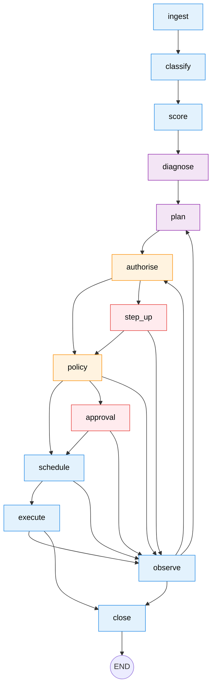

# Anvil

**A revenue-recovery control plane for failed recurring payments.**
Razorpay AI Buildathon 2026 · Track 03: AI Revenue Recovery.

## The problem

A subscription business with ₹1 crore of monthly recurring revenue on UPI Autopay and
e-NACH mandates will see 6–12% of debit attempts fail in a given month. Roughly two thirds
of those are recoverable: a balance that clears on payday, a card the customer would
happily replace, a bank-side technical decline that succeeds four hours later.

The money is not lost at the decline. It is lost in the 48 hours afterwards, while the
merchant retries blindly on a fixed schedule — burning a mandate's finite presentment
allowance on codes that were never going to clear — and escalates identically to the
customer whose card expired and the customer who revoked their mandate. Both are decision
failures, not infrastructure failures. That is what makes this an agent problem.

## The thesis

!!! quote ""
    **The model decides. The ledger disposes. Nothing the model says can move money.**

A stochastic decision layer proposes; a deterministic execution layer — mandate registry,
policy engine, append-only double-entry ledger — disposes. Every rupee that moves is
traceable to a valid authorisation, a policy evaluation that permitted it, and either an
autonomous decision inside pre-agreed bounds or a named human's approval. The invariants
are in the driver's seat and the model gets a bounded steering wheel, which is the inverse
of the usual arrangement.

## Three claims you can check

Each of these is falsifiable from a clean checkout, and each has a place in the repository
where it either holds or visibly does not.

-   **Money cannot be corrupted, structurally**

    ---

    Balances are summed from append-only entries; there is no stored balance to drift.
    `Money.from_major(1499.00)` raises, because floats are refused by the type rather than
    by convention. `UPDATE` on `ledger_entries` is refused by Postgres itself, not by the
    application.

    [The ten invariants](reference/invariants.md) · [Money and the ledger](reference/ledger.md)

-   **Recovery survives the model being gone**

    ---

    With the language model entirely unavailable, the deterministic classifier and a
    conservative plan take over and cases still settle. The degradation path is exercised
    on every test run, not described in a slide.

    [The recovery agent](reference/the-agent.md) · [Architecture](explanation/architecture.md)

-   **The measured result is reported even when it loses**

    ---

    In the seeded batch, naive fixed-schedule dunning beats the agent on raw recovery rate,
    significantly. The calibration table says why: the hazard curves are hand-written priors,
    over-confident by about ten points. Tuning the simulator until the agent won would have
    been easy and would have made every other number here worthless.

    [How recovery is measured](explanation/the-evidence-model.md) · [ADR 0012](adr/0012-report-the-losing-result.md)

## Where to go next

| If you are… | Start at |
|---|---|
| assessing this as a submission | [REVIEWING.md](https://github.com/rohanbatrain/anvil/blob/main/REVIEWING.md) — a routed path in five, fifteen and thirty minutes |
| new to the system | [Recover your first payment](tutorials/first-recovery.md) — a real paused case through the approval queue, in fifteen minutes, with no credentials |
| here for the design | [Architecture](explanation/architecture.md) — the thesis, the invariants, the decline taxonomy, and an explicit account of where AI is *not* used |
| looking for a fact | [Reference](reference/invariants.md), or the live OpenAPI at `/docs` on a running instance |
| asking why something is the way it is | [The sixteen decisions](adr/README.md), each with the alternatives that lost |

The documentation follows [Diátaxis](https://diataxis.fr/): tutorials teach, how-to guides
get a job done, reference states facts, explanation gives reasons. Keeping them apart is
the main thing that stops a docs tree becoming unusable.
