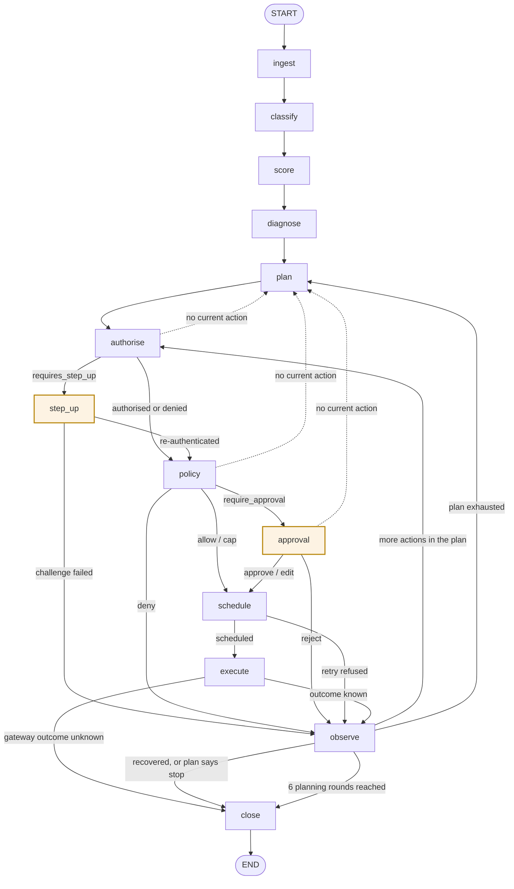

# Anvil — The Recovery Agent

**Reference for the LangGraph recovery agent: its state machine, its nodes, what the model is shown, and what happens when the model is not there.**

> The model decides. The ledger disposes. Nothing the model says can move money.

This document describes the code in `anvil/graph/`, `anvil/llm/` and `anvil/risk/` as it is, including
the seams that are declared but not yet wired. Where something is specified in `docs/explanation/architecture.md`
but not implemented, this document says so rather than describing the specification as if it ran.

---

## 1. Shape of the thing

One `RecoveryState` per recovery case, one LangGraph thread per case, thirteen nodes, two durable
interrupts. The graph is compiled by `build_graph(deps, checkpointer)` in `anvil/graph/build.py` over a
frozen `Deps` container of twelve Protocol ports plus a clock. The orchestrator imports none of the
modules it drives.

The division of labour is the whole design:

| Decided by a model | Decided deterministically |
|---|---|
| Failure class, but **only** when the code tables escalate | Failure class from recognised issuer/NPCI codes |
| The diagnosis behind the class — can they pay, do they intend to | Retry timing and whether to retry at all |
| Which actions to propose, in what order, under a budget | Whether a proposed action is authorised |
| Outreach copy | Whether a proposed action is permitted, and capped to what |
| | Recovery likelihood, churn risk, priority |
| | Whether the case stops, and how it is labelled |

Every model output is a *proposal*. Four gates stand between a proposal and money moving:
authorisation, an optional customer step-up, policy, and an optional human approval.

---

## 2. The state machine

### 2.1 Nodes

Thirteen, registered in `build_graph`:

`ingest` · `classify` · `score` · `diagnose` · `plan` · `authorise` · `step_up` · `policy` ·
`approval` · `schedule` · `execute` · `observe` · `close`

The head of the graph is a fixed line — `START → ingest → classify → score → diagnose → plan →
authorise` — with no conditional edges. Everything from `authorise` onward is routed.

### 2.2 Diagram



The two shaded nodes are the durable interrupts. Dotted edges are defensive branches taken only when
`current_action(state)` returns `None`, which should not happen and routes back to planning if it does.

### 2.3 Routing, exactly

Each router is a pure function of state in `anvil/graph/build.py`.

**`route_after_authorise`** — no current action → `plan`. `requires_step_up` → `step_up`. Everything
else, **including `denied`**, → `policy`. Denied actions are deliberately not short-circuited: they
reach the policy engine so the immutable `unauthorised-actions-never-execute` rule has a value to test
and every refusal is logged the same way.

**`route_after_step_up`** — `step_up_result["succeeded"]` truthy → `policy`, otherwise → `observe`.

**`route_after_policy`** — no action → `plan`. `deny` → `observe`. `require_approval` → `approval`.
Everything else (`allow`, `cap`) → `schedule`.

**`route_after_approval`** — no action → `plan`. Action status `rejected` → `observe`. Otherwise →
`schedule`.

**`route_after_schedule`** — no action, or action status `cancelled` → `observe`. Otherwise → `execute`.

**`route_after_execute`** — case status `pending_reconciliation` → `close`. Otherwise → `observe`.
Nothing further can be decided while a gateway answer is unknown, so the case is parked rather than
re-planned.

**`route_after_observe`** — case status `closing` → `close`. Planning rounds ≥ `MAX_PLANNING_ROUNDS`
(6) → `close`. Case status `executing` with a current action → `authorise`. Otherwise → `plan`.
Planning rounds are counted by scanning `history` for entries whose `node` is `"plan"`.

**There is no edge into `execute` that does not pass `authorise` and then `policy`.** Adding one would
require editing a router, which is a visible change rather than a subtle one.

### 2.4 The loop is bounded three ways

1. **The policy engine's stopping rules.** The normal way a case ends.
2. **`MAX_PLANNING_ROUNDS = 6`**, checked in `route_after_observe`. Reaching it means the bundle is
   missing a stopping rule, and the closure reason says the case stopped rather than settled.
3. **LangGraph's `recursion_limit`.** The backstop only. Both existing callers set it to 80
   (`anvil/simulator/world.py`, `anvil/api/state.py`); the graph tests use 60. Hitting it raises rather
   than closing a case, which is why the round counter exists — "Anvil gave up" and "the graph hit an
   internal ceiling" are different facts and must not be reported as the same one.

### 2.5 The two interrupts

Both call LangGraph's `interrupt()` **inline inside a node**, not via `interrupt_before`. The node does
real work on both sides of the pause — it creates the challenge or queue item first and records the
resolution afterwards — and splitting that across a config flag would put half of one decision in the
graph definition.

| | `step_up` | `approval` |
|---|---|---|
| Interrupt payload `kind` | `afa_step_up` | `human_approval` |
| Payload fields | `challenge_id`, `case_id`, `action_id`, `amount_minor`, `reason` | `approval_id`, `case_id`, `action_id`, `action_type`, `amount_minor`, `rationale`, `confidence` |
| Created before the pause | `authorisation.create_step_up(...)` | `approvals.request(...)` |
| Waiting on | The customer (RBI additional-factor authentication) | A named operator |
| Resume value shape | `{"succeeded": bool}` | `{"decision": "approve"\|"reject"\|"edit", "decided_by": str, "note": str?, "edited_payload": dict?}` |
| Resumed with | `Command(resume=...)` on the same `thread_id` | same |
| Audit on both sides | `step_up_requested` / `step_up_resolved` | `approval_requested` / `approval_resolved` |

Durability is a property of the checkpointer, not of the node. LangGraph commits the checkpoint before
`interrupt()` yields control, so the process can be killed at that instant and the case resumes from
exactly there. In deployment that checkpointer is an `AsyncPostgresSaver`; both current callers and the
tests use `MemorySaver`, which gives the same semantics within one process.

The operator sees the model's own `rationale` verbatim in the approval payload — a test asserts it is
non-empty, because approving an action whose reasoning you cannot read is not being in the loop. An
`edit` decision merges `edited_payload` into the action's payload and, if it carries `amount_minor`,
overwrites the amount **before** the executor reads the action. The human's amendment is what executes,
not a suggestion the agent may ignore.

---

## 3. The state object

`RecoveryState` is a `TypedDict(total=False)` in `anvil/graph/state.py`, not a Pydantic model: LangGraph
merges the partial dict a node returns into the state, and a node returning three keys must not have to
reconstruct the other forty. Every field is JSON-serialisable — ids, integers, plain dicts — so a case
resumed three days later on another machine reconstitutes exactly. Amounts are integer minor units
throughout.

`history` and `actions` accumulate and nothing removes from them, which is what makes any checkpoint a
complete account of how the case got there.

Two helpers enforce that:

- `note(state, node, summary, **detail)` returns the **whole** history list with one entry appended.
  Returning only the new entry would erase the history, because LangGraph merges by replacing keys.
- `replace_action(state, index, **updates)` returns a copied action list with one entry updated. It
  never mutates in place — in-place mutation of a checkpointed structure is how state that looks right
  in memory gets written to Postgres wrong.

### 3.1 Fields and their writers

`initial_state(...)` seeds every counter at a real zero so a node can read `state["attempts_made"]`
without a defensive `.get`, and a missing key means a genuine bug. Arbitrary extra context is accepted
as `**context` and written through.

| Field | Written by |
|---|---|
| `case_id`, `thread_id`, `merchant_id`, `customer_id`, `subscription_id`, `correlation_id` | `initial_state` only |
| `amount_at_risk_minor`, `currency`, `subscription_mrr_minor`, `original_failure_at` | `initial_state` only |
| `amount_recovered_minor` | `execute` (debit settled) |
| `concession_granted_minor` | `execute` (concession granted) |
| `raw_failure_code`, `raw_failure_description` | `initial_state`; overwritten by `execute` from a failed gateway result |
| `bank_narration`, `rail_hint` | `initial_state` only |
| `failure_class`, `classified_deterministically`, `classification_confidence_bps` | `classify` |
| `diagnosis` | `diagnose` |
| `plan_strategy` | `plan` |
| `recovery_likelihood`, `churn_risk`, `priority_score` | `score` |
| `customer_tenure_days`, `customer_lifetime_value_minor`, `prior_failures`, `prior_recoveries`, `prior_concessions_minor`, `contacts_last_24h`, `contacts_last_7d`, `hours_since_last_contact`, `preferred_language` | `initial_state` only — no node refreshes them mid-case |
| `prior_concession_count` | `initial_state`; incremented by `execute` on a granted concession |
| `authorisation_id`, `mandate_attempts_remaining`, `mandate_valid_until` | `authorise` |
| `budget_headroom_minor`, `customer_concession_headroom_minor`, `consent_state`, `merchant_review_first` | `initial_state` only |
| `status` (case) | `ingest`, `step_up`, `approval`, `schedule`, `execute`, `observe`, `close`, and the defensive early returns in `authorise`/`policy` |
| `attempts_made` | `execute` (every debit attempt, whatever the outcome) |
| `contacts_made` | `execute` (outreach, only when the channel actually sent) |
| `actions` | `plan` appends; `authorise`, `step_up`, `policy`, `approval`, `schedule`, `execute` update the current entry |
| `current_action_index` | `plan` (points at the first newly planned action), `observe` (advances) |
| `next_action_at` | `schedule` |
| `human_decision`, `pending_approval_id` | `approval` |
| `step_up_result`, `pending_step_up_id` | `step_up` |
| `history` | every node except three paths that return only an action update |
| `model_safety_events` | `plan` |
| `degraded`, `degraded_reason` | `classify`, `diagnose`, `plan`, `execute` (composer) |
| `model_cost_minor` | `classify` (escalated path), `diagnose`, `plan` — set to `deps.model.cost_minor`, an absolute cumulative figure, not an increment |
| `channel_cost_minor` | `execute` (outreach) |
| `closure_reason`, `closed_at` | `close` |

`merchant_review_first` is declared on the TypedDict rather than passed as loose context for a specific
reason: LangGraph filters state updates down to declared fields, an undeclared key is silently dropped,
and a dropped review-first flag defaults to `True` — which would quietly put every merchant into manual
review.

`hours_since_last_contact` defaults to `NEVER_CONTACTED_HOURS` (8760) from `anvil.policy.facts`, the
sentinel the policy fact catalogue uses for "never contacted", so the two stay in step.

### 3.2 `ProposedAction`

One dict per planned step, which **gains fields as it moves** — by the time it reaches the executor it
carries its own complete justification, which is what makes a persisted action row self-explaining.

| Set by | Fields |
|---|---|
| `plan` | `action_id`, `action_type`, `sequence`, `payload`, `rationale`, `status: "proposed"`, optional `amount_minor`, optional `model_confidence` |
| `authorise` | `authorisation_decision`, `authorisation_id`, `denial_reason`, `status: "denied_by_authorisation"` on a denial |
| `step_up` | rewrites `authorisation_decision` and `denial_reason` from the challenge result |
| `policy` | `policy_effect`, `policy_bundle_id`, `policy_rule_id`, `capped_amount_minor` and an overwritten `amount_minor` when capped lower, `status: "denied_by_policy"` on a deny |
| `approval` | `approval_id`, `status: "approved"`/`"rejected"`, merged `payload` and `amount_minor` on an edit |
| `schedule` | `scheduled_for`, `expected_probability_bps`, `expected_recovery_minor`, `status: "scheduled"`/`"cancelled"` |
| `execute` | `idempotency_key`, `outcome`, `reservation_id`, `status: "succeeded"`/`"failed"`/`"unknown_outcome"`/`"cancelled"`/`"denied_by_policy"` |

### 3.3 Declared but not written

Stated because reading the TypedDict would otherwise suggest otherwise:

- **`batch_id` and `experiment_arm`** are declared and never written by any node. The arm lives on the
  batch runner's own `CaseOutcome` in `anvil/simulator/world.py`.
- **`pending_approval_id` and `pending_step_up_id`** are only ever set to `None`, by the node that just
  finished the corresponding pause. Nothing ever sets them to an id.
- **The `Route` literal** at the top of `state.py` lists `enrich` and `terminate`, which are not nodes,
  and omits `ingest`, which is. It is not imported anywhere; the routers return bare strings.
- **Case status strings.** `"closing"` and `"observing"` are internal markers in neither `CaseStatus` nor
  `ActionStatus`. `"denied_by_authorisation"` is an `ActionStatus` value used as a case status by
  `step_up`. `CaseStatus.AWAITING_APPROVAL` and `AWAITING_STEP_UP` are never written — during a pause
  the case status is whatever the previous node left. `close` always overwrites `status` with a real
  `CaseStatus`, so nothing non-canonical survives to a terminal state.

---

## 4. The nodes

### `ingest` — `anvil/graph/nodes/intake.py`

**In:** the seeded state. **Out:** `status: "diagnosing"`, a history line.
**Side effects:** `ledger.recognise_receivable(...)`, audit `case_opened`.

Recognising the receivable at case open rather than at recovery time is what lets a later write-off
reduce a real asset, and makes "how much are we chasing right now?" a ledger balance instead of a query
over case rows. A test asserts this is the ledger's *first* posting.

### `classify` — `anvil/graph/nodes/intake.py`

**In:** `raw_failure_code`, `raw_failure_description`, `bank_narration`, `rail_hint`.
**Out:** `failure_class`, `classified_deterministically`, `classification_confidence_bps`, and on the
escalated path `model_cost_minor` and possibly `degraded`/`degraded_reason`.
**Side effects:** audit `failure_classified`, with the actor recording which path decided —
`deterministic-classifier`, `model`, or `deterministic-fallback`.

`classifier.classify(...)` runs first. If it resolves, the model is never called and
`classified_deterministically` is `True` — a measured fact, which is what lets the batch report answer
"how much is the LLM actually doing here?" honestly.

If it does not resolve, the node escalates to `model.diagnose(...)` with `purpose: "classification"`.
This is the designed path for free text no code table has seen, not a fallback for a broken lookup.

### `score` — `anvil/graph/nodes/intake.py`

**In:** failure class, amount, tenure, prior failures and recoveries, lifetime value, attempts,
contacts, mandate state. **Out:** `recovery_likelihood`, `churn_risk`, `priority_score`.
**Side effects:** none. **No model is involved.**

Calls `scheduler.schedule(...)` purely to obtain `probability_bps`, which is passed into
`scoring.score(...)` as the anchor when the scheduler says a retry is worth making. Nothing from this
scheduler call is persisted; `act.schedule` runs its own.

### `diagnose` — `anvil/graph/nodes/reason.py`

**In:** `_diagnosis_context(state)` (§5.1). **Out:** `diagnosis`, `model_cost_minor`.
**Side effects:** audit `diagnosis_produced` with the full model result as detail.

The failure class says the debit bounced for insufficient funds. The diagnosis is the more useful
question — can this customer pay at all, do they intend to, is this cash-flow timing or the beginning of
a churn. Those are latent facts the simulator genuinely models and the model genuinely has to infer.

On any exception the node returns `_fallback_diagnosis(state)` and sets `degraded`. That branch returns
early and records **no** audit event, unlike the degraded paths in `classify` and `plan`.

### `plan` — `anvil/graph/nodes/reason.py`

**In:** the diagnosis context plus `diagnosis`; `allowed_actions`; `budget_minor =
min(budget_headroom_minor, customer_concession_headroom_minor)`.
**Out:** appended `actions`, `current_action_index`, `plan_strategy`, `status: "planning"`,
`model_safety_events`, `model_cost_minor`.
**Side effects:** audit `model_safety_event` when anything was rejected, then audit `plan_produced`.

This is where model output is constrained. See §6.

### `authorise` — `anvil/graph/nodes/gate.py`

**In:** the current action. **Out:** action-level `authorisation_decision`, `authorisation_id`,
`denial_reason`; case-level `authorisation_id`, `mandate_attempts_remaining`, `mandate_valid_until`.
**Side effects:** audit `authorisation_checked`.

Fails closed: an absent `decision` in the verdict is read as `denied`.

Terminal actions (`escalate_to_human`, `stop_and_write_off`, `mark_churned`) are marked `authorised`
without a registry call — stopping never needs a mandate, and requiring one would mean a case with a
revoked mandate could not even be closed.

Actions that move no money still pass through, because the authorisation result is *a fact the policy
engine reads*. An absent value would make the `unauthorised-actions-never-execute` rule silently
vacuous.

### `step_up` — `anvil/graph/nodes/gate.py` · **durable interrupt**

**In:** the current action, `authorisation_id`. **Out:** `step_up_result`, `pending_step_up_id: None`,
a rewritten action decision, case `status`.
**Side effects:** `authorisation.create_step_up(...)`, audit `step_up_requested`, then after the pause
audit `step_up_resolved`. Both audit timestamps come from separate `clock.now()` reads, so the record
shows how long the customer took.

### `policy` — `anvil/graph/nodes/gate.py`

**In:** `_facts_for(state, action, now)` — a fixed set of first-party facts (§4.1).
**Out:** action-level `policy_effect`, `policy_bundle_id`, `policy_rule_id`, `capped_amount_minor` and
a lowered `amount_minor` when the cap bites. **Side effects:** audit `policy_evaluated`.

Fails closed the same way: a missing `effect` reads as `deny`. A cap only ever lowers the amount — the
node compares before assigning.

#### 4.1 The fact set

`_facts_for` assembles exactly these, and only these: `action_type`, `amount_minor`, `currency`,
`failure_class`, `hours_since_failure`, `case_attempt_count`, `mandate_cycle_attempt_count`,
`case_contact_count`, `contacts_last_24h`, `contacts_last_7d`, `hours_since_last_contact`,
`local_hour_ist`, `local_day_of_month_ist`, `customer_tenure_days`, `lifetime_value_minor`,
`prior_concession_count`, `prior_concessions_minor`, `customer_concession_headroom_minor`,
`subscription_mrr_minor`, `budget_headroom_minor`, `purpose`, `consent_state`,
`authorisation_decision`, `recovery_likelihood`, `churn_risk`, `merchant_review_first`,
`is_terminal_action`.

Every one is something Anvil observed itself. The policy engine validates the set against its own fact
catalogue and rejects anything outside it, so a typo here is an error at the boundary rather than a rule
that silently never matches. Note that `hours_since_failure` is currently populated from
`hours_since_last_contact`, not from `original_failure_at`.

### `approval` — `anvil/graph/nodes/gate.py` · **durable interrupt**

**In:** the current action, whole. **Out:** `human_decision`, `pending_approval_id: None`, action
`approval_id` and status, merged payload on an edit, case `status`.
**Side effects:** `approvals.request(...)`, audit `approval_requested`, then audit `approval_resolved`
naming the operator.

An absent `decision` in the resume value reads as `reject`.

### `schedule` — `anvil/graph/nodes/act.py`

**In:** the current action, failure class, mandate state, `original_failure_at`.
**Out:** action `scheduled_for`, `expected_probability_bps`, `expected_recovery_minor`, status; case
`next_action_at` and `status`. **Side effects:** none, and no audit record.

**Only `retry_debit` and `split_debit` are scheduled.** Every other action type is stamped
`scheduled_for = now` and passed straight through: outreach value does not depend on issuer timing, and
the quiet-hours rule already governs when a customer may be contacted.

If the scheduler refuses, the action is `cancelled` with the refusal reason in its outcome, the case
returns to `planning`, and the router sends it to `observe`.

### `execute` — `anvil/graph/nodes/act.py`

**In:** one approved action. **Out:** depends on the branch. **Side effects:** gateway, ledger, channel
and audit calls.

An idempotency key is computed first, for every branch, from
`(case_id, action_id, action_type, amount_minor)` via `anvil.core.ids.idempotency_key` — a
blake2b digest prefixed `anvil_`. It depends only on the intent, never on the attempt, so two retries of
the same logical debit collapse at the gateway.

Four branches, and no other paths:

**Debit** (`retry_debit`, `split_debit`) → `gateway.attempt_debit(...)`, audit `action_executed`.
- `settled` → `ledger.settle_recovered(...)`, `amount_recovered_minor` grows, `attempts_made` grows,
  case status `closing`.
- `unknown` → **the books stay untouched.** The action is marked `unknown_outcome`, `attempts_made`
  still grows, and the case moves to `pending_reconciliation`. A gateway timeout does not mean failure;
  it means the request may or may not have moved money, and treating that as a failure and retrying is
  how a customer gets charged twice. The reconciler resolves it with the same key.
- `failed` → the action fails, `raw_failure_code`/`raw_failure_description` are refreshed from the
  gateway so the next planning round sees the new decline, case status `observing`.

**Concession** (`grant_grace_period`, `offer_partial_payment`, `offer_plan_downgrade`,
`offer_winback_discount`) → `ledger.reserve_concession(...)`, then `grant_concession(...)`, then
`settle_concession(...)`, then audit. Never grant without a hold that succeeded. The reservation is
taken under a row lock inside the ledger, so two cases racing for the last of a budget cannot both win.
A `BudgetExhausted` marks the action `denied_by_policy` and returns the case to `planning` with
concessions effectively unavailable — the correct behaviour, not an error.

**Outreach** (`send_reminder`, `send_dunning_notice`, `request_instrument_update`,
`request_mandate_reauth`, `send_payment_link`) → `model.compose(...)`, then `channels.dispatch(...)`,
then audit `message_dispatched`. The channel layer runs its own consent, frequency and quiet-hours
checks and may refuse; that duplication of the policy engine is deliberate, because the two protect
different things. `contacts_made` only increments when the channel actually sent.

**Anything else** (the terminal action types) → marked `succeeded`, case status `closing`. No side
effects.

### `observe` — `anvil/graph/nodes/act.py`

**In:** `actions`, `current_action_index`, the two money totals. **Out:** an advanced
`current_action_index` and a case status. **Side effects:** none.

Three outcomes: recovered in full → `closing`; more actions in the plan → `executing`; plan exhausted →
`planning`.

The stopping rules live in the policy engine rather than here. This node only advances the cursor, which
is what keeps "when do we give up?" a merchant-editable policy question rather than a constant buried in
orchestration code.

### `close` — `anvil/graph/nodes/close.py`

**In:** the whole state. **Out:** terminal `status`, `closure_reason`, `closed_at`.
**Side effects:** `ledger.write_off(...)` when anything is genuinely lost, audit `case_closed`,
`cases.sync(...)`.

`decide_closure(state)` is pure, so an outcome can be classified without running a graph and the same
logic can label historical cases during a backfill. In order:

| Condition | Status | Terminal |
|---|---|---|
| Case status is `pending_reconciliation` | `PENDING_RECONCILIATION` | **No** |
| Recovered ≥ at risk > 0 | `RECOVERED` (the reason names the concession if one was granted) | Yes |
| Retry posture is `NEVER`, nothing recovered, class is `mandate_revoked` | `CHURNED` | Yes |
| Retry posture is `NEVER`, nothing recovered | `UNRECOVERABLE` | Yes |
| Something recovered, but not all | `RECOVERED` (partial) | Yes |
| Otherwise | `ABANDONED` | Yes |

The distinctions are not cosmetic. A revoked mandate is a *decision*, and the only honest label for it
is churn. `ABANDONED` is a success of a kind: a stopping rule fired and Anvil chose to stop spending
attempts and goodwill on a case that was not coming back. A system that never abandons anything is not
persistent, it is expensive.

**Nothing whose fate is unknown is written off.** The write-off is skipped for `RECOVERED` and for
`PENDING_RECONCILIATION`; an unresolved attempt may already have taken the money, and writing it off
would understate what the merchant is owed and have to be reversed the moment it resolves. A test
asserts a gateway timeout writes nothing off.

---

## 5. What reaches the model

Four call sites across three `ModelPort` methods. The port is deliberately three narrow methods rather
than one general one — a port that exposed "ask the model anything" would let a future node quietly hand
the model a decision the architecture says it must not have.

### 5.1 The payloads, verbatim

**`classify` → `model.diagnose`** — `_classification_context(state, verdict)` plus `purpose:
"classification"`:

```
purpose, raw_code, gateway_description, bank_narration, rail_hint,
candidates, escalation_reason
```

**`diagnose` → `model.diagnose`** — `_diagnosis_context(state)`:

```
failure_class, raw_failure_code, raw_failure_description, bank_narration,
amount_at_risk_minor, subscription_mrr_minor, currency,
customer_tenure_days, prior_failures, prior_recoveries, prior_concession_count,
attempts_made, contacts_made, recovery_likelihood, churn_risk,
history  (the last 12 history summaries, strings only)
```

**`plan` → `model.plan`** — the same context, plus `diagnosis`, and two separate arguments:
`allowed_actions` (the closed set) and `budget_minor`.

**`execute` → `model.compose`** — a much narrower context, plus three arguments:

```
context:       failure_class, diagnosis, amount_minor, currency, action_type
purpose:       from the action payload, default "payment_recovery_outreach"
language:      state["preferred_language"]
allowed_facts: failure_class, amount_minor, currency,
               subscription_mrr_minor, customer_tenure_days
```

Every key in every one of these is a first-party fact Anvil observed in its own tables. No customer
name, no VPA, no phone number, no email, no card reference is passed by any node. Identifiers that do
appear are internal — case, customer, subscription and merchant ids — and only inside the
classification bundle's free-text fields.

There is one more model-facing payload defined outside the graph:
`UnresolvedClassification.model_context()` in `anvil/risk/classifier.py`, built by the classifier that
gave up rather than by whoever writes the prompt, carrying `reason`, the three raw text fields, the
normalised `rail`, `deterministic_candidates`, described `evidence`, and `allowed_values` — the full
`FailureClass` enum, so the model is told the closed vocabulary it must answer within.

### 5.2 Redaction

`anvil/llm/redaction.py` is the PII boundary. Its design:

- **Pseudonyms are stable, not opaque.** Every value maps to a deterministic token from a keyed blake2b
  hash — the same VPA is always `[[VPA_1A2B3C4D]]` within a run. A naive `[REDACTED]` destroys exactly
  the reasoning we want: the model could no longer tell that the VPA that failed on Tuesday is the one
  that failed again on Thursday.
- **Precision over recall for card numbers.** Card candidates are Luhn-checked, and a sixteen-digit run
  that fails the checksum is left alone — it was never a card. Roughly nine in ten arbitrary digit runs
  of card length fail, which is what lets the detector be aggressive about card shapes without turning
  order references, UMNs and paise amounts into pseudonyms.
- **Bank account numbers are matched only next to a label** (`a/c no.`, `account ending`). A deliberate
  loss of recall: they carry no checksum and no distinguishing length, and any bare rule wide enough to
  catch a fourteen-digit account catches every RRN in the bundle.
- **Kinds and priority.** `IFSC` > `PAN` > `AADHAAR` > `VPA`/`EMAIL` > `NAME` > `PHONE` > `ACCOUNT`.
  Detectors are allowed to overlap and `_resolve` arbitrates once, in one place.
- **VPAs and emails are separated by whether the right-hand side has a dot.** `ravi@okhdfcbank` is a
  financial identifier; `ravi@example.com` is a contact channel, and conflating them loses that.
- **Names are matched only from a caller-supplied list**, longest first, because names cannot be
  detected by shape without wrecking ordinary prose.
- **Canonicalisation folds renderings.** `+91 98765 43210`, `09876543210` and `9876543210` collapse to
  one token; so do the spaced and hyphenated forms of a card. If the three renderings survived as three
  tokens the model would read them as three customers.
- **Salting is mode-dependent.** Offline runs derive the salt from `settings.seed` so a demo reproduces
  byte for byte; live runs draw one from the OS CSPRNG per process, so the tokens in one day's audit log
  cannot be used to brute-force a card number out of another day's.
- **The reverse map is never persisted.** It lives in memory for one request. `rehydrate()` exists for
  exactly one legitimate caller — the channel adapter at send time — and the rehydrated string is handed
  straight to the provider, never logged or checkpointed. `unresolved_tokens()` flags a message
  assembled from more than one redaction scope.
- `redact_value()` walks a nested JSON structure and redacts dict **keys** as well as values, since a
  dict keyed by VPA would otherwise leak through the key.

**What is actually wired today.** `Redactor` has no caller anywhere in the repository. No node redacts,
and no `ModelPort` implementation exists to redact on the way out — the classifier's own docstring
states the intent ("PII redaction happens downstream, on the way out of the process"), and
`anvil.llm.guardrails`, referenced from `reason.py` as the module that would check outbound copy against
`allowed_facts`, does not exist. The only redaction on a live path is
`anvil.core.logging.redact_processor`, a structlog processor that masks a fixed set of 23 sensitive **log
keys** (`vpa`, `pan`, `phone`, `email`, `anthropic_api_key`, `otp`, and 17 others) before rendering.

That gap is narrow in practice, because §5.1 shows the graph passes no identifier fields to the model.
It is not zero: `bank_narration` and `raw_failure_description` are free text from settlement systems,
and a labelled account number in a narration is exactly what `_ACCOUNT_LABELLED_RE` was written to
catch. Wiring the redactor into a `ModelPort` implementation is the remaining work.

---

## 6. Constraining the model's output

### 6.1 The planner — the one place output is genuinely validated

`reason.plan` filters `result["steps"]` before anything becomes a `ProposedAction`. Three rejection
rules, applied per step:

1. `action_type` not in `allowed` → rejected, `"outside the closed action set"`.
2. `amount_minor` present but not a positive `int` → rejected, `"non-positive amount"`.
3. `ActionType(action_type).is_concession` with no amount → rejected, `"concession with no amount"`.

`allowed` is `deps.allowed_actions` or, when that is empty, every member of `ActionType`. Surviving
steps are rebuilt into a fresh dict — a new `action_id`, a coerced `int` amount, a coerced `str`
rationale, a `dict` payload, `status: "proposed"` — so no unvalidated key from the model reaches the
state.

Rejections are **counted, not silently corrected**: `model_safety_events` accumulates and a
`model_safety_event` audit record names each rejected step and the allowed set. A dashboard that shows
"the model proposed something out of bounds 4 times this batch" is far more trustworthy than one that
implies it never happens.

If nothing survives, the node synthesises a single `escalate_to_human` action with a rationale saying
so. A case is never left with nothing to do, and escalating is always available and always inside
policy, so that path cannot itself fail.

`refuse_out_of_bounds(action_type, allowed)` exists in the same module as a second line of defence
raising `ModelProposedOutOfBounds`. **It has no caller.** Reaching it would be a bug rather than a model
failure, and the planner filter is what actually enforces the closed set today.

### 6.2 Everywhere else, output is coerced rather than validated

Stated plainly because `docs/explanation/architecture.md` §13 describes a Pydantic validate-and-retry loop, and no
such loop exists in the graph:

- **Classification.** `str(result.get("failure_class", "unknown"))` is stored **without being checked
  against the `FailureClass` enum**, and `int(result.get("confidence", 0)) * 100` becomes the
  confidence in basis points. A model that returned a class outside the enum would be persisted, and the
  `FailureClass(...)` construction later in `_fallback_diagnosis`, `close.decide_closure` or the
  scheduler would raise on it. Closing that gap means validating in the node.
- **Diagnosis.** The result dict is stored as `state["diagnosis"]` whole, unvalidated. Only
  `root_cause` is read downstream, coerced with `str()` and truncated to 400 characters for the audit
  summary and 200 for the history line.
- **Composition.** `subject` is taken as-is and `body` is `str(draft.get("body", ""))`. The
  `allowed_facts` list is passed to the port, but the graph never checks the returned copy against it —
  that check is what `anvil.llm.guardrails` was to do.
- **Costs.** `model_cost_minor` is read from the port's own `cost_minor` property, so the case carries a
  cost the model layer reports rather than one the graph computes.

What *does* hold unconditionally is the architectural constraint: whatever the model returns, it becomes
a proposal that must clear `authorise` and `policy` before the executor touches it, and the executor has
exactly four branches. A garbage `action_type` is refused by the planner filter; a garbage diagnosis
changes nothing about what is permitted.

---

## 7. Risk: scoring and the retry scheduler

Nothing in `anvil/risk/` calls a model. The classifier escalates by *returning a value*; it never makes
the call itself.

### 7.1 Deterministic classification — `anvil/risk/classifier.py`

Reads a whole bundle — gateway error slug, free-text description, bank narration, optional rail hint —
rather than one token. Evidence is gathered per field and weighted in basis points:

| Kind | `raw_code` | `gateway_description` | `bank_narration` |
|---|---:|---:|---:|
| `hinted` (code hit in the named rail namespace) | 10000 | 8000 | 7000 |
| `unique` (only one namespace claims the code) | 9000 | 7500 | 6500 |
| `ambiguous` (several namespaces, no rail hint) | 4000 | 3500 | 3000 |
| `text` (whole field matched a textual slug) | 8500 | 7000 | 6000 |
| `phrase` (a natural-language phrase matched) | 6500 | 5500 | 5000 |

The scoring rule in full: each class takes the weight of its **strongest single** piece of evidence,
plus `CORROBORATION_BONUS_BPS` (1000) for every *additional* field that independently agrees, capped at
10000. The leader must clear `RESOLVE_THRESHOLD_BPS` (6000) and beat the runner-up by
`DECISION_MARGIN_BPS` (1500).

Three consequences, all chosen: a recognised code always resolves; a single free-text phrase never does;
two free-text phrases from different systems that agree do.

Escalation is a value — `UnresolvedClassification` with one of three reasons, each mapping to a
different prompt shape: `no_recognised_signal`, `weak_evidence`, `conflicting_signals`. `best_guess` is
exposed for display only and is never persisted as the classification.

Two guards against fabrication are worth naming. In prose fields a bare number counts as a reason code
only when a marker word (`npci`, `rc`, `reason`, `err`, `return`, …) immediately precedes it or the
token looks like a rail code — both a letter and a digit — which is what keeps `"settled 26 Aug"` from
being read as NACH return code 26. And an ambiguous code with no rail hint (`"05"` is a revoked mandate
on NACH and a plain do-not-honour on cards) is reported as ambiguous and escalated, because guessing
between "the customer cancelled" and "the issuer said no this time" is exactly the mistake that sends an
insulting dunning email.

### 7.2 Scoring — `anvil/risk/scoring.py`

Three integers on 0–1000. Integers rather than floats because these are stored, sorted, compared for
equality in tests and rendered in a console, and an integer does all four without a rounding convention
being agreed in four places. The weights are **priors**, chosen to be defensible and then measured by
`anvil/risk/calibration.py`.

**`recovery_likelihood`** — anchored on the hazard curve, not on customer features, because the failure
class dominates. Base is `scheduler_probability_bps // 10` when the scheduler supplied one, else the
first attempt's curve probability. A `NEVER` posture overrides the base to 300 for
`instrument_expired` and 80 otherwise — *not* zero, because an expired card is highly recoverable by
asking for a new one; it is only unrecoverable by *retrying*, which is a different claim. Then
±150 at the extremes for the customer's own recovery rate, −90 per attempt already spent, and up to +80
for tenure.

**`churn_risk`** — a per-class base (120 for `issuer_technical`, 700 for `mandate_revoked`), +180 more
for a deliberately revoked or paused mandate, plus a **steep superlinear contact term**,
`min(300, contacts² × 25)`, plus `min(150, attempts × 40)`, minus loyalty from tenure and past
recoveries. The contact term is the important one: every additional message raises the chance the
customer resolves the situation by cancelling instead of paying, which is the failure mode that makes
naive dunning worse than doing nothing. The scoring has to price that, or the planner will happily send
a sixth reminder.

**`priority`** — expected recoverable value is the spine: `amount × recovery / 1000`, scaled against a
reference of one lakh and capped at 700. Churn *raises* priority rather than lowering it — a customer
about to leave is the one where acting today instead of tomorrow changes the outcome — contributing up
to 200. Lifetime value adds up to 100.

An unknown customer's `recovery_rate_bps` defaults to 5000, the midpoint, not zero. A first-time failure
is not evidence of a bad payer, and scoring it as one would push new customers straight into the
aggressive end of the playbook.

### 7.3 The retry scheduler — `anvil/risk/scheduler.py`

**No model is involved, and there is not even an escalation path to one.** Retry timing is a well-posed
optimisation over a tabulated hazard function with abundant labelled data; asking a model would be
slower, less accurate and non-deterministic.

The decision is not "is now a good time". It is: given a finite number of attempts against this mandate,
and each attempt spent is one that cannot be spent later, when should the next one go? With `A` the
amount at risk and `p(k,t)` the chance the *k*-th remaining attempt settles at hour `t`:

```
V(0, t) = 0
V(k, t) = max over t' >= t of [ p(k,t')·A + (1 − p(k,t'))·V(k−1, t' + gap) ]
```

The expression inside the max does not depend on `t`, so `V(k,·)` is a **suffix maximum** — one backward
pass per level, carrying the argmax with it. The whole solve is `O(attempts × horizon_hours)`: a few
thousand exact `Decimal` operations, fast enough to run inline on every case and simple enough to check
by hand. The argmax at each level is the schedule; the value at the top is what the remaining attempts
are worth, which is the number the planner needs to weigh a concession against continuing to retry.

Constants: `MIN_GAP_HOURS = 6` (issuers treat rapid repeat presentments as abusive, and the optimiser is
not allowed to undercut this however tempting the curve looks), `DEFAULT_HORIZON_HOURS = 720` (thirty
days covers a full salary cycle), probabilities in basis points everywhere they cross a module boundary.

`attempts_remaining = min(curve.max_attempts − attempts_used, mandate_attempts_remaining)`. Every
refusal path is explicit and returns a reason, because "no attempt was scheduled" is otherwise
indistinguishable from "the scheduler never ran", and those are very different bugs:

| Refusal | Reason given |
|---|---|
| Posture is `NEVER` | the class is never worth retrying, with the curve's rationale |
| Curve budget spent | continuing would spend issuer goodwill for nothing |
| Mandate attempts exhausted | no debit attempts left in this billing cycle |
| Mandate expires before `now + 6h` | no hour left in which an attempt could legitimately be made |
| No whole hour in the window | same, at hour-bucket granularity |

The hazard curve for each class composes four independent lookups — attempt number, hours since failure,
IST hour-of-day (the overnight NPCI/issuer maintenance window), and IST day-of-month for the
balance-driven classes. `explain()` names the factor that actually moved the number, not a post-hoc
story. `ranked` carries the top 24 hours by expected value for the console's curve chart.

Retry budgets by class, from `RETRY_CURVES`:

| Class | Posture | Max attempts | Salary-sensitive |
|---|---|---:|---|
| `issuer_technical` | `retry_fast` | 3 | no |
| `insufficient_funds` | `retry_scheduled` | 4 | **yes** |
| `limit_exceeded` | `retry_scheduled` | 3 | no |
| `mandate_paused` | `deferred` | 2 | no |
| `unknown` | `retry_once` | 1 | no |
| `auth_required` | `deferred` | 0 | — |
| `instrument_expired`, `mandate_revoked`, `account_closed`, `risk_declined` | `never` | 0 | — |

`value_of_retrying(...)` wraps the same solve to answer the planner's question directly: offering ₹200
to save a subscription whose remaining retries are already worth ₹1,100 in expectation is giving money
away; offering it when they are worth ₹40 is good business. Having the number makes that arithmetic
rather than taste.

### 7.4 Calibration — `anvil/risk/calibration.py`

Not on the graph's path; fed by the batch runner and the evidence API from the ex-ante probability of
every attempt. Three measures because they answer different questions: a **reliability table** (where is
it wrong?), a **Brier score** (how wrong overall — mean squared error, which punishes confident mistakes
far more than hedged ones), and **expected calibration error** (how wrong in a way that matters).

Below `minimum_sample` (100) the report renders but its verdict says the sample is too small to conclude
anything. Empty buckets are omitted rather than shown as zero, because a bucket with no predictions is
an absence of evidence, and rendering it as a zero gap would claim otherwise.

### 7.5 Detection — `anvil/risk/detection.py`

Upstream of the graph: it decides which subscriptions get a case at all. Pure, no I/O. Returns a *list*
per subscription, because a failed debit against a mandate that also expires next week is materially
more urgent than either alone and collapsing that into one signal would lose it.

Signals emitted: `DEBIT_FAILED` (urgency 700+), `ATTEMPTS_NEARLY_EXHAUSTED` (900 — the next attempt is
the last one, so its timing carries the whole cycle), `MANDATE_EXPIRING` and `INSTRUMENT_EXPIRING`
(500/450, within a 45-day lookahead), `DEGRADING` (300 — the last three-plus cycles settled, but only
after two-plus attempts on average). `RiskSignal.REPEATED_LATE_SETTLEMENT` is declared and never
emitted.

`detect_all` skips subscriptions with an open case by default: a second case would double-count the
money at risk and let two graphs contact the same customer independently. `total_at_risk` counts each
subscription once — a subscription flagged by three signals is not three times the money.

---

## 8. Ports and dependency injection

`anvil/graph/ports.py` declares twelve `runtime_checkable` Protocols; `anvil/graph/deps.py` holds them
in a frozen, slotted `Deps` dataclass alongside a `Clock` and an `allowed_actions` tuple. The graph is
the one module that touches everything, so it imports none of it.

| Port | The authority it grants |
|---|---|
| `ClassifierPort` | `classify(...) → {"resolved", "failure_class", "confidence_bps", …}` |
| `SchedulerPort` | `schedule(...) → {"should_retry", "at", "probability_bps", …}` — never a model |
| `ScoringPort` | `score(...) → {"recovery_likelihood", "churn_risk", "priority"}` |
| `ModelPort` | `diagnose`, `plan`, `compose`, and a `cost_minor` property. Every method may raise |
| `AuthorisationPort` | `authorise(...)`, `create_step_up(...)` — fails closed, always |
| `PolicyPort` | `evaluate(case_id, merchant_id, facts) → {"effect", "rule_id", "capped_amount_minor", …}` |
| `ApprovalPort` | `request(...) → approval_id` |
| `LedgerPort` | `recognise_receivable`, `settle_recovered`, `grant_concession`, `write_off`, plus `reserve`/`release`/`settle_concession` |
| `GatewayPort` | `attempt_debit(...)` with a caller-owned idempotency key, `create_payment_link(...)` |
| `ChannelPort` | `dispatch(...)` — runs its own consent, frequency and quiet-hours checks and may refuse |
| `AuditPort` | `record(...)` — redaction is the implementation's job, not the graph's |
| `CasePort` | `sync(state)`, `persist_action(...)` |

`LedgerPort` is the one worth reading closely. **There is no `post` and no way to construct an arbitrary
entry.** The orchestrator can record the four economic events a recovery can cause and nothing else, so
a bug in a node cannot invent a posting the chart of accounts never anticipated. Reading that Protocol
tells you in one place exactly how much authority the agent has over the books.

`GatewayPort.attempt_debit` returns `unknown` as a **first-class outcome, not an error** — it means the
request may or may not have moved money, and the only correct response is reconciliation with the same
key.

Three declared methods have no caller in any node: `CasePort.persist_action`,
`LedgerPort.release_concession` (the executor only ever reserves-then-settles) and
`GatewayPort.create_payment_link` (`send_payment_link` is handled as outreach).

### 8.1 Composition roots

`anvil/graph/deps.py` and `ports.py` both name `anvil.graph.wiring` as the composition root.
**That module does not exist.** Two roots build `Deps` today:

- `anvil/simulator/world.py` (line 288) — the batch runner, wiring the graph to the seeded simulator with
  `merchant_review_first=False` so the batch does not stall on approvals.
- `anvil/api/state.py` (line 152) — the console, wiring the same doubles but leaving
  `merchant_review_first=True`, which is what makes the live approval queue fill with genuinely paused
  cases.

Neither supplies a real Anthropic-backed `ModelPort`; there is no LLM client in `anvil/llm/`. The batch
runs one of two stand-ins:

- **`_FallbackModel`** — every method raises. It drives the graph down its documented degradation path,
  makes the batch reproducible with no API key, and makes every reported number a **floor** achieved
  with the language model contributing nothing.
- **`_ClassifyingModel`** — resolves free-text reason strings the code tables cannot, at
  `CLASSIFIER_ACCURACY = 0.88`, at 3 paise a call. Deliberately not an oracle: the rest of the time it
  returns a plausible wrong class, so the measured benefit includes the cost of the model being wrong.
  Its `plan` and `compose` still raise, so the difference between this arm and the fallback arm isolates
  exactly one thing — what it is worth to understand a reason code nobody wrote a rule for.

### 8.2 How the ports are faked in tests

`tests/unit/test_graph.py` hand-writes one double per port — `StubClassifier`, `StubScheduler`,
`StubScoring`, `StubModel`, `StubAuthorisation`, `StubPolicy`, `StubApprovals`, `StubLedger`,
`StubGateway`, `StubChannels`, `StubAudit`, `StubCases` — assembled by `make_deps(**overrides)` over a
`FrozenClock`, with `make_state(**overrides)` for the seed and `run(deps, state, thread)` compiling the
graph over a `MemorySaver`. The whole orchestration runs with no database, no network and no model.

The doubles are built to *produce failures on demand* rather than to make the happy path pass:

| Double | Knob | Path it opens |
|---|---|---|
| `StubModel(available=False)` | every method raises `RuntimeError("anthropic api unavailable")` | full degraded mode |
| `StubModel(steps=[...])` | arbitrary planner output | out-of-bounds action types, negative amounts, amount-less concessions |
| `StubGateway("unknown")` | gateway timeout | `PENDING_RECONCILIATION`, nothing written off |
| `StubPolicy(DENY / REQUIRE_APPROVAL)` | policy verdict | denial, and the approval interrupt |
| `StubAuthorisation(DENIED / REQUIRES_STEP_UP)` | registry verdict | denial, and the step-up interrupt |
| `StubLedger(budget_available=False)` | `reserve_concession` raises `BudgetExhausted` | concession refused mid-plan |
| `StubChannels(sent=False)` | channel suppression | frequency-cap refusal |

`StubLedger` records `(kind, amount)` postings and `StubGateway` records idempotency keys, so the
structural invariants are asserted against observed calls rather than against internal state: the
receivable is the first posting; `authorisation_checked` and `policy_evaluated` both appear in the audit
trail *before* `action_executed`; a denial leaves `gateway.keys == []`.

The most load-bearing tests are the ones where something goes wrong. A graph that recovers a payment on
the happy path is unremarkable; a graph that keeps working when the model is unavailable, refuses what
the model should not have proposed, and declines to guess when the gateway times out is the actual
submission. `test_the_graph_always_reaches_a_resting_state` sweeps every gateway outcome × channel
outcome and asserts the case lands in a terminal status or `PENDING_RECONCILIATION` — never an open loop
and never a status nobody chose.

`tests/conftest.py` raises the structlog level to `ERROR` for the session, because the degradation
warnings are expected behaviour and there are thousands of them in a batch.

---

## 9. Degraded mode

Every model call site is wrapped in a bare `except Exception`. The model is the one dependency assumed
to fail, and the degradation is not a token gesture — it is exercised by its own tests and it is the
path the reproducible batch runs on by default.

| Call site | On failure | State written |
|---|---|---|
| `classify` | `failure_class = UNKNOWN`, confidence 0 | `degraded`, `degraded_reason`, audit actor `deterministic-fallback` |
| `diagnose` | `_fallback_diagnosis(state)` from `RETRY_CURVES` | `degraded`, `degraded_reason`, **no audit record** |
| `plan` | `_fallback_plan(deps, state)` | `degraded`, `degraded_reason` = the strategy string, audit actor `deterministic-fallback` |
| `compose` | `_template(state, purpose, language)` | `degraded`, `degraded_reason` |

Each also emits a `structlog` warning: `classifier_model_unavailable`, `diagnosis_unavailable`,
`planner_unavailable`, `composer_unavailable`, carrying `case_id` and the exception string.

`degraded` is **sticky**. Nothing sets it back to `False` once any call site has failed, so a case that
degraded once reports as degraded at closure, and `case_closed` carries the flag.

**The fallback diagnosis** is drawn entirely from the taxonomy, so it is never wrong — merely coarse. It
sets `source: "deterministic-fallback"` explicitly so nothing downstream, and no operator reading the
console, mistakes it for a model's reasoning. `can_pay` is false only for `account_closed`;
`intends_to_pay` is false for `mandate_revoked` and `mandate_paused`; `confidence` is 0.

**The fallback plan** is conservative and derived entirely from the retry curve:

- curve is retryable → a single `retry_debit` for the full amount, at the hour the deterministic
  scheduler already chose;
- `instrument_expired` → `request_instrument_update`;
- `mandate_revoked` → `request_mandate_reauth`;
- anything else → `escalate_to_human`.

**No concessions are ever offered on this path.** Deciding that a concession is worth its cost is
exactly the judgement the model was there to make, and a test asserts the degraded plan proposes no
concession action.

**The fallback copy** is deliberately plain and factual, in English or Hindi by
`state["preferred_language"]`, asserting only the amount Anvil already holds. No urgency it cannot
justify, no offer it has not been authorised to make.

**What still works with the model entirely absent.**
`test_recovery_continues_when_the_model_is_unavailable` runs the whole graph against a model that raises
on every call and asserts the case reaches `RECOVERED` with the money on the books. Classification falls to `UNKNOWN`, whose curve permits exactly
one conservative attempt before a human looks at it. Recovery continues; it just gets less clever.

### 9.1 When the model returns garbage rather than failing

Distinct from unavailability, and handled less completely:

- **A planner step outside the closed set, or with a bad amount** — filtered, counted as a model-safety
  event, and if nothing survives the case escalates to a human rather than proceeding on a guess. This
  is fully handled and tested three ways.
- **A classification outside the `FailureClass` enum** — stored as-is. The next `FailureClass(...)`
  construction raises. Not currently guarded.
- **A malformed diagnosis or empty composed body** — stored/sent as-is. The diagnosis only ever reaches
  the model again as context and the audit log as a string; an empty body still goes to the channel
  layer, which applies its own checks.
- **There is no retry-with-validation-error loop.** `docs/explanation/architecture.md` §13 describes one and
  `settings.llm_max_retries` is defined at 3, but the graph does not implement it: one exception is one
  degradation.

### 9.2 Non-model failure modes the graph does handle

| Failure | Behaviour |
|---|---|
| Gateway returns `unknown` | Books untouched, action marked `unknown_outcome`, case parked in `PENDING_RECONCILIATION`, **nothing written off**, never a blind retry |
| Concession budget exhausted | `BudgetExhausted` caught, action `denied_by_policy`, case returns to planning with concessions effectively unavailable |
| Channel refuses to send | Action `cancelled`, `contacts_made` not incremented, the refusal reason recorded on the audit event |
| Authorisation denied | Action still passes through `policy` so the refusal is logged once, in one place; never executes |
| Policy denies | Routed to `observe`; never executes |
| Scheduler refuses a retry | Action `cancelled` with the refusal reason; the case re-plans |
| Worker crashes mid-case | The checkpointer holds the last committed state; the case resumes from that node |
| Planner loops | `MAX_PLANNING_ROUNDS` closes the case with a reason saying the bundle is missing a stopping rule |

---

## 10. Audit trail

Every node that makes a consequential decision records it. The `actor` and `actor_kind` fields carry the
distinction that matters: `deterministic-classifier`/`system` versus `model`/`agent` versus
`deterministic-fallback`/`system`, so the audit log answers "did a model decide this?" without
inference.

Events the graph emits, in the order a settled case produces them:

`case_opened` → `failure_classified` → `diagnosis_produced` → [`model_safety_event`] →
`plan_produced` → `authorisation_checked` → [`step_up_requested`, `step_up_resolved`] →
`policy_evaluated` → [`approval_requested`, `approval_resolved`] → `action_executed` /
`message_dispatched` → `case_closed`.

`case_closed` carries the case's own summary: recovered, conceded and written-off amounts, attempts,
contacts, `model_safety_events` and the `degraded` flag. That last pair is the point — a system that
reports how often its model proposed something out of bounds, and how often it ran without a model at
all, is making a claim a judge can check.

---

## 11. Known gaps

Collected from the sections above, so they are in one place rather than scattered:

1. **No `ModelPort` implementation exists.** `anvil/llm/` contains redaction and nothing else; both
   composition roots use simulator stand-ins.
2. **`Redactor` has no caller.** Redaction is designed and tested but not on any live path; only
   structlog key masking is wired.
3. **`anvil.graph.wiring` and `anvil.llm.guardrails` are referenced in docstrings and do not exist.**
4. **Classifier output is not validated against the `FailureClass` enum.**
5. **No validate-and-retry loop** for malformed model output, despite `llm_max_retries` being configured.
6. **`refuse_out_of_bounds` is never called**; the planner filter is the only enforcement.
7. **`persist_action`, `release_concession` and `create_payment_link`** are declared on ports and never
   called.
8. **`batch_id` and `experiment_arm`** are declared on the state and never written.
9. **`hours_since_failure`** in the policy fact set is populated from `hours_since_last_contact`.
10. **`RiskSignal.REPEATED_LATE_SETTLEMENT`** is declared and never emitted.
